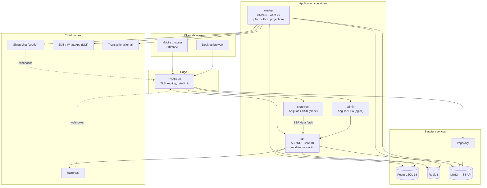
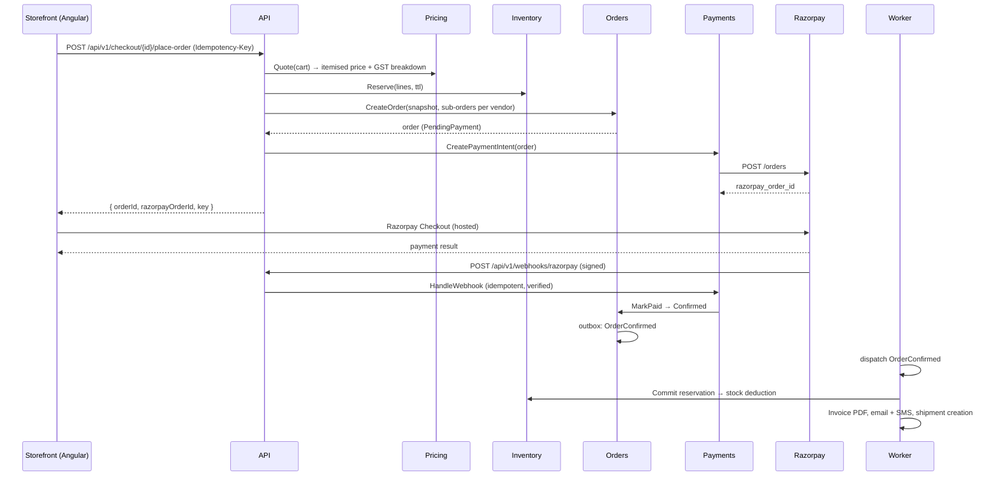

# 01 — Overall Architecture Specification

> Klara Home · Multi-vendor e-commerce platform · India
> Angular (SSR, mobile-first) · .NET 10 · PostgreSQL · Docker on VPS

---

## 1. Business Context

| Aspect | Decision |
|---|---|
| Market | **India only** (v1). Currency INR, locale `en-IN`, timezone Asia/Kolkata. |
| Model | **Multi-vendor marketplace** — the platform operator lists many sellers. |
| Redistribution | The product must be **re-deployable for other businesses on separate infrastructure**. No client-specific branding, copy, tax rule, or business rule may be hard-coded. |
| Payments | **Razorpay** (UPI, cards, net banking, wallets, EMI) + **Cash on Delivery**. Vendor payouts via Razorpay Route / RazorpayX. |
| Scope v1 | Core commerce, inventory & warehouse operations, CMS & merchandising, promotions & pricing engine. |
| Channels | Responsive web (mobile-first) storefront + separate admin/vendor web app. Native apps are Phase 2. |

### 1.1 Redistribution model (important)

The platform is **single-tenant-per-deployment, tenant-aware in code**:

- Each client gets their own containers, database and object storage — the cleanest isolation
  story, the easiest sale, and no noisy-neighbour risk.
- The schema and code nevertheless carry a `tenant_id` and resolve **all** branding, legal
  identity, tax configuration, business rules and theming from the database/config at runtime.
- Consequence: converting to a shared multi-tenant SaaS later is a deployment change, not a
  rewrite. Doing that conversion is explicitly Phase 2.

---

## 2. Architecture Style — and why

**Modular monolith** (a single deployable ASP.NET Core process composed of strictly separated
modules), plus a small number of separate containers for the frontends and background work.

**Why not microservices:** the target runtime is a single VPS, the team is small, and every
commerce flow here (cart → pricing → inventory → order → payment) needs transactional
consistency. Microservices would buy distributed-transaction complexity we do not need and
operational cost we cannot justify. The module boundaries below are drawn exactly where
services would be split later, so extraction stays cheap if volume ever demands it.

### 2.1 Module boundary rules (enforced, not aspirational)

1. A module owns its **own Postgres schema**. No cross-schema foreign keys, no cross-module
   table reads. Ever.
2. Modules talk to each other **only** through:
   - a published C# **contract interface** in a `*.Contracts` project (synchronous, in-process), or
   - an **integration event** via the transactional outbox (asynchronous).
3. A module's internal types (entities, DbContext) are `internal` and never leave the module.
4. Architecture tests (NetArchTest) fail the build on any violation.
5. Cross-module data needed for reads is **projected** into the reading module (e.g. the search
   projection, the order's product snapshot), never joined live.

---

## 3. C4 — Container View



### 3.1 Container responsibilities

| Container | Tech | Responsibility |
|---|---|---|
| `traefik` | Traefik v3 | TLS termination (Let's Encrypt), host/path routing, edge rate limiting, security headers, gzip/brotli |
| `storefront` | Angular 20+ with `@angular/ssr` on Node | Customer-facing SSR web app. SEO-critical, mobile-first |
| `admin` | Angular 20+ SPA on nginx | Back office for platform staff **and** vendors (role-scoped). No SSR needed |
| `api` | ASP.NET Core 10 | All business logic, all modules, REST API, webhook receivers |
| `worker` | ASP.NET Core 10 (same image, different entrypoint) | Outbox dispatch, scheduled jobs, notification sending, report generation, projection rebuilds, reconciliation |
| `postgres` | PostgreSQL 18 | System of record. One database, one schema per module |
| `redis` | Redis 8 | Distributed cache, output cache, rate-limit counters, distributed locks, Hangfire-adjacent transient state |
| `minio` | MinIO | S3-compatible object storage for media and documents. Swappable for AWS S3 (ap-south-1) or Cloudflare R2 with a config change only |
| `imgproxy` | imgproxy | On-the-fly image resizing/format conversion (WebP/AVIF), signed URLs |
| `migrator` | .NET job container | Runs EF Core migrations as a one-shot job during deploy. The API never migrates on startup in production |

Running `api` and `worker` from the same image with a different entrypoint keeps deployment
simple while ensuring a long-running job can never starve a customer request.

---

## 4. Backend Structure

### 4.1 Solution layout

```
src/backend/
  KlaraHome.sln
  host/
    KlaraHome.Api/                 # HTTP host: composition root, middleware, endpoint mapping
    KlaraHome.Worker/              # Background host: outbox, schedules, projections
    KlaraHome.Migrator/            # One-shot migration runner
  shared/
    KlaraHome.SharedKernel/        # Result<T>, Money, Error, base entity, clock, guards
    KlaraHome.Infrastructure/      # EF conventions, outbox, caching, storage, messaging abstractions
    KlaraHome.Contracts/           # Cross-module contracts + integration event definitions
  modules/
    KlaraHome.Modules.Platform/
    KlaraHome.Modules.Identity/
    KlaraHome.Modules.Media/
    KlaraHome.Modules.Vendors/
    KlaraHome.Modules.Catalog/
    KlaraHome.Modules.Inventory/
    KlaraHome.Modules.Pricing/
    KlaraHome.Modules.Carts/
    KlaraHome.Modules.Orders/
    KlaraHome.Modules.Payments/
    KlaraHome.Modules.Shipping/
    KlaraHome.Modules.Returns/
    KlaraHome.Modules.Settlements/
    KlaraHome.Modules.Search/
    KlaraHome.Modules.Content/
    KlaraHome.Modules.Reviews/
    KlaraHome.Modules.Notifications/
    KlaraHome.Modules.Reporting/
tests/
  KlaraHome.UnitTests/
  KlaraHome.IntegrationTests/      # Testcontainers-backed, per module
  KlaraHome.ArchitectureTests/     # Boundary enforcement
  KlaraHome.LoadTests/             # k6 scripts
```

### 4.2 Internal shape of a module

Each module is a **vertical slice** architecture, not a layered one:

```
KlaraHome.Modules.Catalog/
  Domain/            # Entities, value objects, domain events, invariants. No EF, no HTTP.
  Application/       # Commands, queries, handlers, validators, DTOs, policies
    Products/
      CreateProduct/ { Command.cs, Handler.cs, Validator.cs, Response.cs }
      GetProduct/    { Query.cs, Handler.cs, Response.cs }
  Infrastructure/    # DbContext, EF configurations, repositories, external adapters
  Endpoints/         # Minimal API endpoint definitions grouped by resource
  CatalogModule.cs   # IModule implementation: AddServices(), MapEndpoints()
```

### 4.3 Key technology choices

| Concern | Choice | Rationale |
|---|---|---|
| Runtime | .NET 10 (LTS), C# 14 | Long-term support through the client's expected lifecycle |
| API style | ASP.NET Core **Minimal APIs**, grouped by resource | Lower ceremony, better startup, first-class OpenAPI in .NET 10 |
| API versioning | URL segment `/api/v1/...` | Explicit, cache-friendly, unambiguous |
| Mediation | Lightweight in-house `ICommandHandler`/`IQueryHandler` dispatcher | Avoids MediatR's commercial licence; ~150 lines, fully testable, no runtime reflection cost with source-gen registration |
| Validation | FluentValidation via a pipeline behaviour | Consistent 422 responses from one place |
| Mapping | **Mapperly** (source generator) or hand-written | Compile-time, allocation-free; avoids AutoMapper's commercial licence |
| ORM | EF Core 10 + Npgsql; Dapper for hot read paths | EF for writes/aggregates, raw SQL where query shape matters (search, reports) |
| Background jobs | Hangfire (PostgreSQL storage) in `worker` | Retries, scheduling, dashboard, no extra broker on the VPS |
| Messaging | **Transactional outbox** + in-process dispatch | Reliable eventing without RabbitMQ. Broker can be added later behind the same abstraction |
| Caching | Redis via `HybridCache` (.NET 9+) | L1 in-memory + L2 Redis, stampede protection built in |
| Resilience | `Microsoft.Extensions.Http.Resilience` (Polly) | Retry, timeout, circuit breaker on every outbound integration |
| Logging | Serilog → JSON stdout → Promtail/Loki | Container-native |
| Telemetry | OpenTelemetry (traces, metrics, logs) | Vendor-neutral; Prometheus + Tempo on the VPS |
| Auth | ASP.NET Core Identity + self-issued JWT; OpenIddict if a standards-compliant auth server is later required | Fewest moving parts for v1, documented upgrade path |
| PDF | **PDFsharp 6 + MigraDoc** (MIT) | Invoices, credit notes, manifests. QuestPDF was the original choice and is dual-licensed above USD 1 M revenue, which a redistributed deployment cannot carry — see ADR-015 |
| Testing | xUnit, FluentAssertions, Testcontainers, NSubstitute, Playwright, k6 | — |

> **Licensing note:** MediatR and AutoMapper moved to commercial licences in 2024–25. Both are
> deliberately avoided so the redistributable product carries no per-client licence liability.
> This must be re-verified at Step 1 before packages are pinned.

---

## 5. Request Flow — worked example

**Customer places an order (prepaid):**



Three properties this design guarantees:

1. **Order truth comes from the webhook, never from the browser.** The client callback is a UX
   convenience only.
2. **Reservation before order, commit after payment.** Oversell is prevented without holding
   stock forever.
3. **Everything after `OrderConfirmed` is asynchronous and retryable.** A failing SMS provider
   can never fail a paid order.

---

## 6. Cross-Cutting Concerns

| Concern | Approach |
|---|---|
| Correlation | `X-Correlation-Id` accepted or generated at the edge; flows through logs, traces, outbox events and outbound calls |
| Idempotency | `Idempotency-Key` header required on all money-moving and order-mutating POSTs; stored with the response hash for 24h |
| Errors | RFC 9457 ProblemDetails, stable machine-readable `code`, field-level errors for validation, never leaking internals |
| Concurrency | `xmin`-based optimistic concurrency on aggregates; explicit row locks for stock and ledger operations |
| Time | All timestamps `timestamptz`, stored UTC, rendered in the store's timezone. `IClock` abstraction — no `DateTime.Now` anywhere |
| Money | `Money` value object (`decimal(18,4)` + ISO currency). No floats. Rounding rules centralised in Pricing |
| Soft delete | Only where business history requires it; hard delete elsewhere. Global query filters |
| PII | Field-level classification; masked in logs; export & erasure endpoints for DPDP compliance |
| Feature flags | DB-backed, cached, admin-editable — used to keep half-built Phase-2 features dark |

---

## 7. Environments

| Environment | Purpose | Location |
|---|---|---|
| Local | Development | Developer machine, `docker-compose.dev.yml` |
| Staging | Integration, UAT, sandbox third parties | VPS (separate compose project + database) |
| Production | Live | VPS |

Identical images across environments; behaviour differs only by environment variables and
secrets. No environment-specific `#if` in code.

---

## 8. Repository Layout

```
KlaraHome/
  docs/                      # This specification set
  src/
    backend/                 # .NET solution (see §4.1)
    frontend/                # Nx workspace
      apps/storefront/
      apps/admin/
      libs/ui/ data-access/ domain/ util/ i18n/ testing/
  infra/
    docker/                  # Dockerfiles
    compose/                 # docker-compose.{dev,staging,prod}.yml
    traefik/
    observability/           # Prometheus, Loki, Grafana provisioning
    scripts/                 # deploy, backup, restore, seed
  .github/workflows/         # or .gitlab-ci.yml
  tools/                     # codegen, db tooling
```

---

## 9. Architecture Decision Records (initial set)

| ADR | Decision | Status |
|---|---|---|
| ADR-001 | Modular monolith over microservices | Accepted |
| ADR-002 | One Postgres schema per module; no cross-schema joins | Accepted |
| ADR-003 | Transactional outbox instead of a message broker in v1 | Accepted |
| ADR-004 | Angular SSR for the storefront (SEO); CSR for admin | Accepted |
| ADR-005 | Separate admin application, not a route in the storefront | Accepted |
| ADR-006 | Single-tenant-per-deployment, tenant-aware schema | Accepted |
| ADR-007 | PostgreSQL FTS before adopting a dedicated search engine | Accepted |
| ADR-008 | Razorpay hosted checkout only — no card data on our servers (SAQ-A) | Accepted |
| ADR-009 | Avoid commercially licensed libraries (MediatR, AutoMapper) | Accepted |
| ADR-010 | MinIO with the S3 API, so cloud object storage is a config swap | Accepted |
| ADR-015 | PDFsharp + MigraDoc for generated documents, not QuestPDF | Accepted (Step 8) |
| ADR-016 | Media is its own module, with its own `media` schema | Accepted (Step 8) |
| ADR-017 | A notification channel with no provider is suppressed, not failed | Accepted (Step 8) |
| ADR-018 | Shiprocket is the named v1 courier; adapters are keyed by courier and delivery coverage is a policy | Accepted (Step 16 boundary) |
| ADR-019 | PostgreSQL full text answers queries, behind a seam a dedicated engine can take over | Accepted (Step 19) |
| ADR-020 | A rule-based collection is materialised into rows; a block type is a declared, validated schema | Accepted (Step 20) |

ADRs are maintained in `docs/adr/` from Step 1 onward; any change to the above requires a new
ADR and User approval.

---

## 10. Known Constraints & Risks

| Risk | Impact | Mitigation |
|---|---|---|
| Single VPS = single point of failure | Total outage | Tested restores, off-site backups, documented rebuild runbook; scale-out path is Swarm/second node |
| VPS resource ceiling | Degradation under load | Resource limits per container, load test at Step 29, defined vertical-scale trigger points |
| Postgres FTS limits at large catalogue | Slow search | Projection table + measured thresholds; Meilisearch swap behind a feature flag |
| Razorpay webhook loss | Orders stuck unpaid | Reconciliation job polls Razorpay; alert on stuck states |
| Logistics aggregator API instability | Dispatch delays | Provider interface + retries + manual AWB fallback in admin |
| GST/marketplace rules change | Compliance exposure | Tax rates and TCS/TDS rates are configuration, never code |
| Scope breadth of v1 | Timeline | The 33-step gated plan; strict parking lot discipline |
