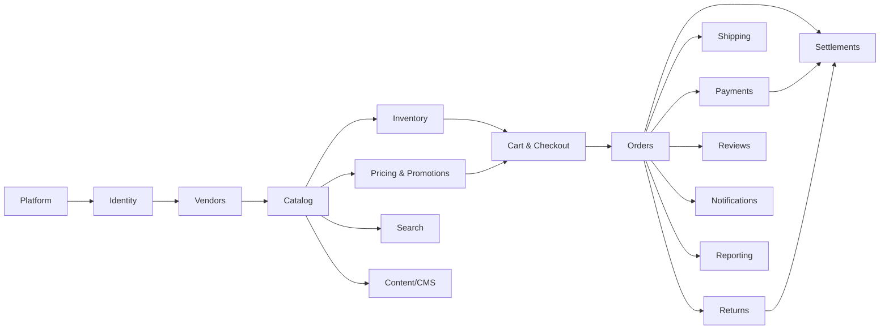
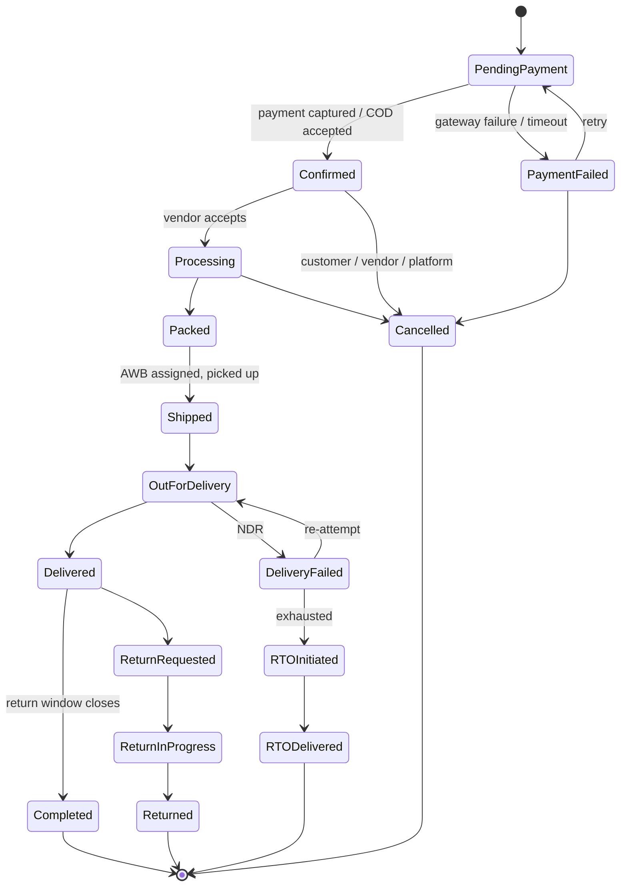

# 02 — Domain Model & Bounded Contexts

> Ubiquitous language, module boundaries, aggregates, state machines and integration events.
> This document is the contract that keeps `03-database-design.md` and the code honest.

---

## 1. Actors

| Actor | Description | Primary surface |
|---|---|---|
| **Guest** | Unauthenticated shopper | Storefront |
| **Customer** | Registered shopper (mobile + OTP) | Storefront |
| **Vendor Owner** | Legal owner of a seller account | Admin app (vendor scope) |
| **Vendor Staff** | Operates listings/orders for one vendor | Admin app (vendor scope) |
| **Catalog Manager** | Platform staff: taxonomy, moderation | Admin app |
| **Operations** | Platform staff: orders, fulfilment, returns | Admin app |
| **Merchandiser** | Platform staff: CMS, promotions, collections | Admin app |
| **Finance** | Platform staff: settlements, payouts, reconciliation | Admin app |
| **Platform Admin** | Full control incl. users, roles, settings | Admin app |
| **Support** | Read + limited actions, audited impersonation | Admin app |
| **System** | Jobs, webhooks, schedulers | — |

---

## 2. Bounded Contexts (map)



| Context | Owns | Does NOT own |
|---|---|---|
| **Platform** | Tenant, store settings, feature flags, audit log, reference data (states, PIN codes, HSN) | Anything transactional |
| **Identity** | Users, credentials, sessions, roles, permissions, customer profile, addresses | Vendor business data |
| **Vendors** | Seller entity, KYC, commission plans, vendor settings, pickup locations | Vendor's products (Catalog owns them) |
| **Catalog** | Categories, brands, attributes, products, variants, vendor listings/offers, media links, compliance fields | Stock quantity, price calculation |
| **Inventory** | Warehouses, stock ledger, reservations, purchase orders, GRN, stock takes | Product definition |
| **Pricing** | Price lists, tax rules, promotions, coupons, wallet/credit, the **quote engine** | Storing order totals (Orders snapshots them) |
| **Cart** | Cart, cart lines, checkout session | Order |
| **Orders** | Order, sub-order, order lines, order timeline, invoices | Payment status truth (Payments owns it), shipment (Shipping owns it) |
| **Payments** | Payment intents, transactions, refunds, gateway webhooks, COD collection records | Order state transitions (it requests them) |
| **Shipping** | Shipping zones/rates, serviceability, shipments, packages, tracking events, NDR | Stock |
| **Returns** | RMA, pickup, QC disposition, credit notes | Refund execution (delegates to Payments) |
| **Settlements** | Commission, fees, TCS/TDS, vendor ledger, payout batches | Payment capture |
| **Search** | Search projection, facets, synonyms, query log | Source-of-truth catalog data |
| **Content** | Pages, blocks, banners, menus, collections, redirects, SEO metadata | Products |
| **Reviews** | Reviews, ratings, Q&A, wishlist, back-in-stock subscriptions | Orders |
| **Notifications** | Templates, channels, delivery log, preferences | Business events |
| **Reporting** | Read models, aggregates, exports | Writes to any other context |

---

## 3. Ubiquitous Language (selected — the terms that cause bugs when confused)

| Term | Precise meaning here |
|---|---|
| **Product** | The marketable concept ("Cotton Cushion Cover 40×40"). Not sellable by itself. |
| **Variant / SKU** | A concretely specified sellable thing (colour=Beige, size=40×40). Stock and price attach here. |
| **Listing (Offer)** | A **vendor's** offer to sell a Variant at a price, with their own stock and dispatch SLA. Multiple vendors → multiple Listings → one Variant. |
| **Buy Box** | The Listing selected by default on the PDP for a Variant, by the configured rule. |
| **Order** | The customer's single purchase event. Payment attaches here. |
| **Sub-order** | The per-vendor slice of an Order. Fulfilment, invoicing, cancellation and settlement all happen here. |
| **Order Line** | One Listing × quantity within a Sub-order, with a frozen price/tax snapshot. |
| **Shipment** | A physical consignment with one AWB. A Sub-order may produce several. |
| **Reservation** | A time-limited hold on stock during checkout. Not a deduction. |
| **MRP** | Maximum Retail Price — statutory in India, always displayed, never below selling price. |
| **Place of Supply** | The state determining CGST+SGST vs IGST. Derived from the shipping address vs the vendor's GST state. |
| **Settlement** | Converting delivered/returned orders into a net amount payable to a vendor. |
| **Payout** | The actual money transfer to a vendor's bank account. |

---

## 4. Aggregates & Invariants

### 4.1 Catalog

```
Product (root)
 ├─ ProductAttributeValue[]
 ├─ ProductMedia[]
 └─ Variant[] (root candidate; addressed via Product)
      ├─ VariantAttributeValue[]   (the defining axes)
      └─ VariantMedia[]

Listing (root)   -- vendor's offer
 ├─ vendor_id, variant_id
 ├─ price fields (MRP, selling price)
 └─ fulfilment settings
```

Invariants:
- A Variant's defining attribute combination is unique within its Product.
- A Listing is unique per (vendor, variant).
- A Product cannot be Active with zero Active Variants.
- A Variant cannot be Active without HSN code, GST rate, MRP, net quantity and country of origin
  (Indian legal requirement).
- A Listing cannot be Active if its Vendor is not Active.

### 4.2 Inventory

```
StockItem (root)  -- (listing_id, location_id)
 ├─ StockLedgerEntry[]   (append-only)
 └─ StockReservation[]
```

Invariants:
- `quantity_on_hand = Σ(ledger entries)` — always reconcilable, never edited directly.
- `available = on_hand − reserved`; `available >= 0` always.
- Every quantity change writes a ledger entry with a reason code and an actor.
- Reservations expire; expiry release is itself a ledger entry.

### 4.3 Cart

```
Cart (root)
 ├─ CartLine[]
 └─ CheckoutSession (0..1)
```

Invariants:
- One active Cart per customer (or per anonymous token).
- Cart lines reference a Listing, not a Variant — the seller is part of the intent.
- Cart totals are **never stored**; they are computed by the Pricing quote engine on read.

### 4.4 Orders

```
Order (root)
 ├─ customer + address snapshot
 ├─ payment summary (mirrored from Payments, eventually consistent)
 └─ SubOrder[]  (one per vendor)
      ├─ OrderLine[]  (frozen price, tax, commission basis)
      ├─ OrderEvent[] (timeline, append-only)
      └─ Invoice (0..1)
```

Invariants:
- An Order has ≥1 Sub-order; a Sub-order has ≥1 Line; all lines in a Sub-order share one vendor.
- Order monetary totals equal the sum of sub-order totals; sub-order totals equal the sum of
  line totals + shipping + tax − discount. Asserted on every write.
- Price, tax rate, MRP, product name and image are **snapshotted** at placement — later catalog
  edits never alter historical orders.
- A Sub-order can only be invoiced once (per invoice series, gapless, per financial year).
- Order state is **derived** from sub-order states by a documented rule (see §5.2).

### 4.5 Payments

```
Payment (root)
 ├─ PaymentAttempt[]     (gateway interactions)
 ├─ Refund[]
 └─ GatewayEvent[]       (raw webhook payloads, append-only)
```

Invariants:
- Σ(captured) − Σ(refunded) ≤ order total. Over-refund is impossible.
- Every gateway event is stored raw before processing, and processed exactly once
  (unique gateway event id).
- COD is a Payment with method=COD, captured when the courier remits.

### 4.6 Settlements

```
VendorLedger (root, per vendor)
 └─ LedgerEntry[]        (append-only, double-entry style)
PayoutBatch (root)
 └─ PayoutItem[]
```

Invariants:
- Ledger is append-only; corrections are reversing entries, never edits.
- A ledger entry always references its source document (order line, refund, adjustment).
- A payout can only include settled, unpaid entries; an entry can appear in exactly one payout.

---

## 5. State Machines

### 5.1 Sub-order lifecycle (the real workhorse)



Rules:
- Transitions are declared in one table (from, to, allowed roles, guard). Nothing transitions
  by ad-hoc code.
- Cancellation is allowed up to `Packed` for the customer; Operations may cancel later with a
  reason and audit entry.
- Stock is **committed** on `Confirmed` and **returned** on `Cancelled`, `RTODelivered`, or
  `Returned` with QC pass.
- Settlement eligibility begins at `Delivered` + return window (configurable, default 7 days).

### 5.2 Order status derivation

The parent Order status is computed, not set:
- all sub-orders `Cancelled` → `Cancelled`
- all sub-orders terminal-successful → `Completed`
- any sub-order `PendingPayment` → `PendingPayment`
- otherwise → `InProgress` (with a per-vendor breakdown shown to the customer)

### 5.3 Other state machines

| Aggregate | States |
|---|---|
| Vendor | Applied → UnderReview → Approved → Active ⇄ Suspended → Offboarded |
| Product | Draft → PendingApproval → Active ⇄ Inactive → Archived |
| RMA | Requested → Approved/Rejected → PickupScheduled → Picked → InTransit → Received → QCPassed/QCFailed → Refunded/Replaced → Closed |
| Payment | Created → Attempted → Authorized → Captured → PartiallyRefunded → Refunded / Failed / Expired |
| Shipment | Created → LabelGenerated → PickupScheduled → PickedUp → InTransit → OutForDelivery → Delivered / Exception / RTO |
| CMS Page | Draft → InReview → Scheduled → Published → Unpublished → Archived |
| PayoutBatch | Draft → Approved → Processing → Completed / PartiallyFailed / Failed |

---

## 6. Integration Events (outbox)

Naming: `<Context>.<Aggregate><PastTenseVerb>` · versioned payloads · always carry
`tenantId`, `occurredAt`, `correlationId`.

| Event | Published by | Consumed by |
|---|---|---|
| `Vendors.VendorActivated` | Vendors | Catalog (allow listings), Settlements (open ledger), Notifications |
| `Catalog.ListingPublished` / `ListingUpdated` / `ListingDeactivated` | Catalog | Search, Inventory, Content |
| `Inventory.StockLevelChanged` | Inventory | Search (availability facet), Reviews (back-in-stock), Notifications |
| `Pricing.PriceChanged` | Pricing | Search, Reviews (price-drop alerts) |
| `Carts.CartAbandoned` | Cart | Notifications, Reporting |
| `Orders.OrderPlaced` | Orders | Payments, Inventory, Notifications, Reporting |
| `Orders.SubOrderConfirmed` | Orders | Inventory (commit), Shipping (create shipment), Notifications, Settlements |
| `Orders.SubOrderCancelled` | Orders | Inventory (release), Payments (refund), Settlements (reverse), Notifications |
| `Payments.PaymentCaptured` / `PaymentFailed` / `RefundCompleted` | Payments | Orders, Settlements, Notifications |
| `Shipping.ShipmentDispatched` / `TrackingUpdated` / `ShipmentDelivered` / `NdrRaised` | Shipping | Orders, Notifications, Reporting |
| `Returns.ReturnApproved` / `ReturnReceived` / `ReturnQcCompleted` | Returns | Inventory, Payments, Settlements |
| `Settlements.PayoutCompleted` | Settlements | Notifications, Reporting |
| `Reviews.ReviewPublished` | Reviews | Catalog (rating projection), Search |

Delivery semantics: **at-least-once**. Every handler must be idempotent, keyed on
`(eventId, handlerName)` in a processed-messages table.

---

## 7. India-Specific Domain Rules (v1 must-haves)

1. **GST**: rate resolved from HSN; `place_of_supply` = shipping state. Vendor GST state ==
   place of supply → CGST + SGST (half each); otherwise IGST (full). Prices are displayed
   **inclusive of GST**; the breakdown is back-calculated and shown on the invoice.
2. **Invoice per vendor**: each sub-order produces the vendor's own tax invoice with the
   vendor's GSTIN, a gapless per-vendor series per financial year (Apr–Mar).
3. **Marketplace deductions**: TCS under GST §52 and TDS under §194-O are computed on the
   vendor's supply value at settlement; both rates are configuration.
4. **Mandatory listing disclosures** (Legal Metrology + Consumer Protection (E-Commerce) Rules
   2020): MRP, net quantity, country of origin, manufacturer/packer/importer name and address,
   consumer-care contact, seller's legal name and address, return/refund policy, grievance
   officer details.
5. **COD**: an order-level payment method with eligibility rules (PIN serviceability, order
   value cap, customer risk flags, category exclusions), a COD handling fee option, and
   courier remittance reconciliation.
6. **Address model**: line1, line2, landmark, city, **state (from the official list)**,
   6-digit PIN code, mobile (+91, 10 digits), optional GSTIN for business buyers.
7. **DPDP Act 2023**: consent capture for marketing, data export and erasure workflows,
   breach-notification readiness, purpose limitation on PII fields.
8. **Card data**: never stored or transmitted by us — RBI tokenisation and PCI scope stay with
   Razorpay's hosted checkout.

---

## 8. Authorisation Model (summary; detail in `07-security-compliance.md`)

- Permissions are fine-grained strings: `catalog.product.create`, `orders.suborder.cancel`,
  `settlements.payout.approve`.
- Roles are named bundles of permissions; roles are data, not code, so a redistributed
  deployment can define its own.
- Every vendor-scoped query is filtered by the caller's `vendor_id` **in the data layer**, not
  in the controller — a missing filter must be impossible, not merely unlikely.
- Customer-scoped resources are filtered by `customer_id` the same way.
