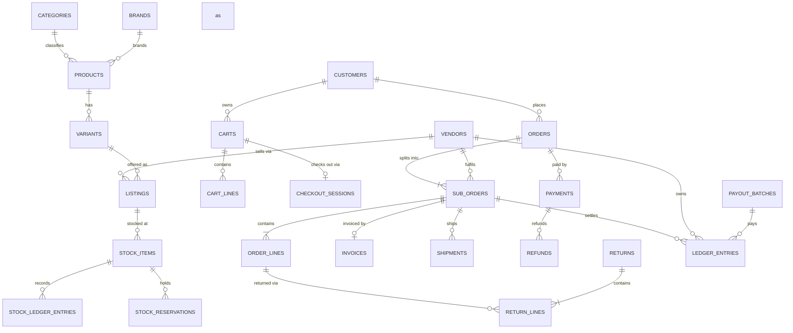

# 03 — Database Design (PostgreSQL 18)

> One database, one **schema per module**, no cross-schema foreign keys.
> Cross-module references are stored as plain UUID columns and validated by the owning module.

---

## 1. Global Conventions

| Convention | Rule |
|---|---|
| Naming | `snake_case`; tables **plural**; columns singular; PK `id`; FK `<entity>_id` |
| Primary keys | `uuid` holding **UUIDv7** generated in application code (time-ordered → index-friendly, no PK contention, safe to expose) |
| Tenancy | Every business table carries `tenant_id uuid not null`; every index is `(tenant_id, ...)`-prefixed; EF global query filter enforces it |
| Timestamps | `created_at timestamptz not null default now()`, `updated_at timestamptz`, both UTC |
| Auditing | `created_by uuid`, `updated_by uuid` on mutable business tables; full before/after in `platform.audit_logs` |
| Soft delete | `deleted_at timestamptz null` only where history matters (products, listings, categories, users, CMS). Elsewhere hard delete |
| Concurrency | System column `xmin` mapped as the EF concurrency token |
| Money | `numeric(18,4)`; a sibling `currency_code char(3) not null default 'INR'`. **Never** float |
| Quantity | `integer` for units; `numeric(12,3)` where a category needs fractional units |
| Percentages | `numeric(7,4)` (e.g. GST 18 → `18.0000`) |
| Enums | Postgres `text` + `CHECK` constraint, mapped to C# enums. Avoids native-enum migration pain |
| JSON | `jsonb` for genuinely open shapes (CMS blocks, gateway payloads, attribute snapshots) — never for relational data |
| Text search | `tsvector` generated columns + GIN; `pg_trgm` for fuzzy |
| Constraints | Every business invariant that *can* be a DB constraint *is* one |
| Time zone | Server UTC; display timezone from store settings |

### Extensions required

`pgcrypto`, `pg_trgm`, `unaccent`, `btree_gin`, `pg_stat_statements`.

---

## 2. Schema Map

| Schema | Module | Notes |
|---|---|---|
| `platform` | Platform | Tenants, settings, feature flags, audit, reference data, outbox |
| `identity` | Identity | Users, roles, sessions, addresses |
| `vendors` | Vendors | Sellers, KYC, commission plans, pickup locations |
| `catalog` | Catalog | Taxonomy, products, variants, listings, media |
| `inventory` | Inventory | Warehouses, stock, ledger, reservations, POs |
| `pricing` | Pricing | Price lists, tax rules, promotions, coupons, wallet |
| `carts` | Cart | Carts, lines, checkout sessions |
| `orders` | Orders | Orders, sub-orders, lines, events, invoices |
| `payments` | Payments | Payments, attempts, refunds, gateway events |
| `shipping` | Shipping | Zones, rates, serviceability, shipments, tracking |
| `returns` | Returns | RMAs, pickups, QC, credit notes |
| `settlements` | Settlements | Commission, ledger, payout batches |
| `search` | Search | Projections, synonyms, query log |
| `content` | Content | Pages, blocks, banners, menus, collections, redirects |
| `reviews` | Reviews | Reviews, Q&A, wishlist, subscriptions |
| `notifications` | Notifications | Templates, messages, preferences, delivery log |
| `reporting` | Reporting | Materialised views and rollup tables |

---

## 3. Core ERD (abridged to the commerce spine)

---

## 4. Table Specifications

Only columns that carry design decisions are listed; every table also has the standard
`tenant_id`, audit and timestamp columns from §1.

### 4.1 `platform`

**`tenants`** — `id`, `code` (unique), `name`, `status`, `settings jsonb`
**`store_settings`** — `tenant_id`, `key`, `value jsonb`, `is_public bool`, unique `(tenant_id, key)`
Holds legal entity, GSTIN, addresses, support contacts, business rules (return window, COD cap),
locale, timezone, and **all branding references**. Nothing branded is compiled in.

**`feature_flags`** — `key`, `enabled`, `rollout jsonb`, `description`
**`audit_logs`** — `actor_id`, `actor_type`, `action`, `entity_type`, `entity_id`, `before jsonb`, `after jsonb`, `ip`, `user_agent`, `correlation_id`, `occurred_at`. Append-only; monthly partitions.
**`outbox_messages`** — `id`, `type`, `payload jsonb`, `occurred_at`, `processed_at`, `attempts`, `error`, `correlation_id`. Index `(processed_at, occurred_at) where processed_at is null`.
**`inbox_messages`** (idempotent handling) — `message_id`, `handler`, `processed_at`, PK `(message_id, handler)`.
**`idempotency_keys`** — `key`, `endpoint`, `request_hash`, `response_status`, `response_body jsonb`, `expires_at`, unique `(tenant_id, key, endpoint)`.
**`states`** — official Indian states/UTs with GST state code.
**`pincodes`** — `pincode`, `city`, `district`, `state_id`, `zone`.
**`hsn_codes`** — `code`, `description`, `default_gst_rate`.

### 4.2 `identity`

**`users`** — `mobile` (E.164, unique per tenant), `email` (unique per tenant, nullable),
`password_hash` (nullable — OTP-only and provider-only users exist), `mobile_verified_at`,
`email_verified_at`, `status`, `user_type` (`customer|vendor|staff`), `failed_attempts`,
`locked_until`, `totp_secret_encrypted`, `totp_enabled`, `must_change_password` (set when an
administrator issues a temporary password; the next sign-in is challenged, not sessioned).
**`external_logins`** — `user_id`, `provider` (`google|facebook`), `subject` (the provider's stable
id), `email`, `email_verified`, `display_name`, `linked_at`, `last_login_at`. Unique
`(tenant_id, provider, subject)`. The subject is the only linking key; see
`07-security-compliance.md` §1 for why an email address is not.
**`roles`** — `code`, `name`, `scope` (`platform|vendor`), `is_system`.
**`permissions`** — `code`, `group`, `description`.
**`role_permissions`**, **`user_roles`** — `user_id`, `role_id`, `vendor_id` (nullable; set for
vendor-scoped role assignments).
**`refresh_tokens`** — `token_hash`, `user_id`, `device`, `ip`, `expires_at`, `revoked_at`,
`replaced_by_id`. Rotation chain retained for detection of reuse.
**`otp_challenges`** — `destination`, `channel`, `code_hash`, `purpose`, `attempts`, `expires_at`, `consumed_at`.
**`customer_profiles`** — `user_id`, `first_name`, `last_name`, `dob`, `gender`, `gstin`,
`marketing_consent_at`, `referral_code`.
**`addresses`** — `user_id`, `label`, `recipient_name`, `mobile`, `line1`, `line2`, `landmark`,
`city`, `state_id`, `pincode`, `is_default_shipping`, `is_default_billing`, `gstin`, `type`.

### 4.3 `vendors`

**`vendors`** — `code`, `legal_name`, `display_name`, `slug`, `status`, `gstin`, `pan`,
`business_type`, `registered_address jsonb`, `support_email`, `support_phone`,
`commission_plan_id`, `dispatch_sla_hours`, `return_policy jsonb`, `rating`, `onboarded_at`,
`gateway_account_id` (Razorpay Route linked account).
**`vendor_users`** — `vendor_id`, `user_id`, `is_owner`.
**`vendor_kyc_documents`** — `vendor_id`, `doc_type`, `file_id`, `number_masked`, `status`,
`verified_by`, `verified_at`, `rejection_reason`.
**`vendor_bank_accounts`** — `account_name`, `account_number_encrypted`, `ifsc`, `is_primary`,
`verification_status`.
**`commission_plans`** — `name`, `type` (`flat|percentage|tiered`), `default_rate`.
**`commission_plan_rules`** — `plan_id`, `category_id` (nullable = default), `min_price`,
`max_price`, `rate`, `fixed_fee`. Resolution: most specific category, then price band, then default.
**`vendor_pickup_locations`** — address + `is_default` + courier location code.

### 4.4 `catalog`

**`categories`** — `parent_id`, `name`, `slug` (unique per tenant), `path ltree|text` materialised
path, `level`, `position`, `is_active`, `image_file_id`, `seo jsonb`, `attribute_set_id`.
**`brands`** — `name`, `slug`, `logo_file_id`, `is_active`.
**`attribute_sets`**, **`attributes`** — `code`, `name`, `data_type`
(`text|number|boolean|select|multiselect|date`), `is_variant_defining`, `is_filterable`,
`is_searchable`, `unit`, `position`.
**`attribute_options`** — `attribute_id`, `value`, `label`, `position`.
**`products`** — `category_id`, `brand_id`, `name`, `slug`, `description`, `short_description`,
`status`, `hsn_code`, `gst_rate`, `country_of_origin`, `manufacturer jsonb`, `importer jsonb`,
`packer jsonb`, `is_returnable`, `return_window_days`, `warranty`, `seo jsonb`,
`rating_avg numeric(3,2)`, `rating_count`, `published_at`, `search_vector tsvector generated`.
**`product_attribute_values`** — `product_id`, `attribute_id`, `value_text`, `value_number`,
`value_boolean`, `value_option_id`.
**`variants`** — `product_id`, `sku` (unique per tenant), `barcode`, `name_suffix`,
`weight_grams`, `length_mm`, `width_mm`, `height_mm`, `mrp`, `net_quantity`, `status`,
`position`, `is_default`.
**`variant_attribute_values`** — the defining combination; unique index on the hashed combination
per product.
**`listings`** — `vendor_id`, `variant_id`, `status`, `mrp`, `selling_price`,
`vendor_sku`, `handling_time_hours`, `is_cod_allowed`, `max_order_quantity`,
unique `(tenant_id, vendor_id, variant_id)`.
**`product_media`** / **`variant_media`** — `file_id`, `type` (`image|video|doc`), `alt_text`, `position`.
**`product_moderation`** — `product_id`, `submitted_by`, `status`, `reviewer_id`, `notes`, `reviewed_at`.

**Buy-box rule** (configurable in `store_settings`): lowest landed price → then vendor rating →
then dispatch SLA → then stock availability.

### 4.5 `inventory`

**`warehouses`** — `vendor_id` (null = platform-owned), `code`, `name`, `address jsonb`,
`pincode`, `is_active`, `priority`.
**`stock_items`** — `listing_id`, `warehouse_id`, `quantity_on_hand`, `quantity_reserved`,
`reorder_level`, `reorder_quantity`, `allow_backorder`, unique `(tenant_id, listing_id, warehouse_id)`.
Both quantity columns are **derived caches** maintained in the same transaction as the ledger,
with a nightly reconciliation job asserting they match the ledger sum.
**`stock_ledger_entries`** — `stock_item_id`, `change` (signed), `balance_after`, `reason`
(`purchase|sale|reservation|release|return|adjustment|damage|transfer_in|transfer_out|correction`),
`reference_type`, `reference_id`, `note`, `actor_id`, `occurred_at`. **Append-only**, monthly partitions.
**`stock_reservations`** — `stock_item_id`, `cart_id|order_id`, `quantity`, `status`
(`held|committed|released|expired`), `expires_at`.
**`suppliers`**, **`purchase_orders`**, **`purchase_order_lines`**, **`goods_receipts`**,
**`goods_receipt_lines`**, **`stock_takes`**, **`stock_take_lines`**.

Constraints: `quantity_on_hand >= 0`, `quantity_reserved >= 0`,
`quantity_reserved <= quantity_on_hand` (unless backorder allowed).

### 4.6 `pricing`

**`price_lists`** — `name`, `type` (`base|sale|scheduled`), `priority`, `starts_at`, `ends_at`, `is_active`.
**`price_list_items`** — `price_list_id`, `listing_id`, `price`, `min_quantity`.
**`tax_rates`** — `hsn_code`, `rate`, `cess_rate`, `effective_from`, `effective_to`.
**`promotions`** — `code` (null for automatic rules), `name`, `type`
(`percentage|fixed|free_shipping|bogo|bundle|tiered`), `value`, `scope jsonb` (categories,
brands, vendors, listings, customer segments), `conditions jsonb`, `stacking`
(`exclusive|stackable`), `priority`, `starts_at`, `ends_at`, `usage_limit_total`,
`usage_limit_per_customer`, `min_order_value`, `max_discount`, `is_active`.
**`promotion_redemptions`** — `promotion_id`, `customer_id`, `order_id`, `discount_amount`.
**`wallets`** / **`wallet_transactions`** — store credit and loyalty accrual (feature-flagged).

**Quote engine output** (not persisted here; returned to callers and snapshotted by Orders):
per line — `unit_mrp`, `unit_price`, `quantity`, `gross`, `line_discount`,
`order_discount_allocated`, `taxable_value`, `cgst`, `sgst`, `igst`, `cess`, `line_total`;
per sub-order — shipping, shipping tax, COD fee; per order — grand total, rounding adjustment.

### 4.7 `carts`

**`carts`** — `customer_id` (nullable), `anonymous_token`, `status` (`active|converted|abandoned|expired`),
`currency_code`, `coupon_code`, `last_activity_at`, `expires_at`.
**`cart_lines`** — `cart_id`, `listing_id`, `quantity`, `added_at`, `saved_for_later bool`,
unique `(cart_id, listing_id)`.
**`checkout_sessions`** — `cart_id`, `shipping_address_snapshot jsonb`, `billing_address_snapshot jsonb`,
`shipping_option_id`, `payment_method`, `quote_snapshot jsonb`, `status`, `expires_at`.

### 4.8 `orders`

**`orders`** — `order_number` (human-readable, unique per tenant), `customer_id`,
`customer_snapshot jsonb`, `shipping_address jsonb`, `billing_address jsonb`,
`place_of_supply_state_id`, `status`, `payment_method`, `payment_status`,
`items_total`, `discount_total`, `shipping_total`, `tax_total`, `cod_fee`, `grand_total`,
`currency_code`, `coupon_code`, `channel`, `placed_at`, `completed_at`, `cancelled_at`,
`cancellation_reason`, `notes`.
**`sub_orders`** — `order_id`, `vendor_id`, `sub_order_number`, `status`, totals (same shape),
`dispatch_due_at`, `confirmed_at`, `delivered_at`, `return_window_ends_at`.
**`order_lines`** — `sub_order_id`, `listing_id`, `variant_id`, `product_snapshot jsonb`
(name, image, attributes, HSN, brand at time of purchase), `sku`, `quantity`, `unit_mrp`,
`unit_price`, `discount_amount`, `taxable_value`, `gst_rate`, `cgst`, `sgst`, `igst`, `cess`,
`line_total`, `commission_rate`, `commission_amount`, `status`, `quantity_cancelled`,
`quantity_returned`.
**`order_events`** — `order_id`, `sub_order_id`, `type`, `from_status`, `to_status`,
`actor_type`, `actor_id`, `payload jsonb`, `is_customer_visible`, `occurred_at`. Append-only.
**`invoices`** — `sub_order_id`, `invoice_number` (unique per vendor per FY, gapless),
`series`, `financial_year`, `issued_at`, `taxable_value`, `cgst`, `sgst`, `igst`, `total`,
`file_id`, `irn`, `qr_payload` (e-invoicing ready), `status`.
**`order_number_sequences`** / **`invoice_number_sequences`** — `scope_key`, `financial_year`,
`next_value`, locked with `SELECT ... FOR UPDATE` to guarantee gapless allocation.

### 4.9 `payments`

**`payments`** — `order_id`, `method` (`upi|card|netbanking|wallet|emi|cod`), `provider`
(`razorpay|internal_cod`), `provider_order_id`, `amount`, `amount_captured`, `amount_refunded`,
`status`, `authorized_at`, `captured_at`, `failure_code`, `failure_reason`.
**`payment_attempts`** — `payment_id`, `provider_payment_id`, `status`, `method_detail jsonb`
(masked), `error jsonb`, `attempted_at`.
**`refunds`** — `payment_id`, `return_id` (nullable), `amount`, `reason`, `status`,
`provider_refund_id`, `initiated_by`, `initiated_at`, `completed_at`, `speed`.
**`gateway_events`** — `provider`, `event_id` (unique), `event_type`, `signature_valid`,
`payload jsonb`, `received_at`, `processed_at`, `process_error`, `attempts`. Append-only.
**`cod_collections`** — `sub_order_id`, `shipment_id`, `amount`, `collected_at`,
`remitted_at`, `remittance_reference`, `status`.
**`gateway_settlements`** — imported Razorpay settlement reports for reconciliation.

### 4.10 `shipping`

**`shipping_zones`** — `name`, `states jsonb`, `pincode_ranges jsonb`, `priority`.
**`shipping_rates`** — `zone_id`, `vendor_id` (nullable override), `method`
(`standard|express`), `min_weight`, `max_weight`, `min_order_value`, `max_order_value`,
`base_rate`, `per_kg_rate`, `free_above`, `cod_fee`, `eta_min_days`, `eta_max_days`.
**`serviceability_cache`** — `pincode`, `courier`, `prepaid_ok`, `cod_ok`, `eta_days`, `refreshed_at`.
**`shipments`** — `sub_order_id`, `courier`, `awb`, `status`, `label_file_id`,
`manifest_id`, `weight_grams`, `dimensions jsonb`, `pickup_scheduled_at`, `picked_up_at`,
`delivered_at`, `expected_delivery_at`, `provider_shipment_id`, `cod_amount`.
**`shipment_lines`** — `shipment_id`, `order_line_id`, `quantity` (supports partial shipment).
**`tracking_events`** — `shipment_id`, `status`, `location`, `remark`, `occurred_at`,
`raw jsonb`, unique `(shipment_id, provider_event_id)`.
**`ndr_records`** — `shipment_id`, `reason`, `attempt_number`, `action_taken`, `resolved_at`.

### 4.11 `returns`

**`returns`** — `return_number`, `sub_order_id`, `customer_id`, `type` (`return|replacement`),
`status`, `reason_code`, `reason_note`, `evidence_file_ids jsonb`, `requested_at`,
`approved_at`, `rejected_reason`, `pickup_awb`, `received_at`, `qc_status`, `qc_notes`,
`qc_by`, `refund_amount`, `refund_mode` (`original|wallet`), `closed_at`.
**`return_lines`** — `return_id`, `order_line_id`, `quantity`, `unit_refund`, `tax_refund`,
`restock_decision` (`restock|scrap|quarantine`).
**`return_reasons`** — configurable reason codes with per-reason policy (who pays return
shipping, whether evidence is required).
**`credit_notes`** — `return_id`, `credit_note_number` (gapless per vendor per FY), `issued_at`,
`taxable_value`, tax split, `total`, `file_id`.

### 4.12 `settlements`

**`ledger_entries`** — `vendor_id`, `entry_type` (`sale|commission|payment_fee|shipping_fee|
refund|refund_commission_reversal|tcs|tds|adjustment|payout`), `direction` (`credit|debit`),
`amount`, `reference_type`, `reference_id`, `sub_order_id`, `order_line_id`, `settlement_cycle_id`,
`payout_batch_id`, `occurred_at`, `note`. **Append-only.**
**`settlement_cycles`** — `vendor_id`, `period_start`, `period_end`, `status`, `gross_sales`,
`total_commission`, `total_fees`, `total_refunds`, `tcs`, `tds`, `net_payable`, `closed_at`.
**`payout_batches`** — `reference`, `status`, `total_amount`, `vendor_count`, `approved_by`,
`processed_at`, `provider_batch_id`.
**`payout_items`** — `payout_batch_id`, `vendor_id`, `settlement_cycle_id`, `amount`, `status`,
`provider_payout_id`, `utr`, `failure_reason`.

Balance check (asserted in tests and a nightly job):
`Σ credits − Σ debits = closing balance` per vendor, and `Σ payouts ≤ Σ settled net`.

### 4.13 `search`

**`product_search_projection`** — one row per (variant, buy-box listing): denormalised name,
brand, category path, attributes `jsonb`, price, discount %, rating, vendor, availability,
popularity score, `search_vector tsvector`, `updated_at`. GIN on `search_vector`, GIN on
attributes `jsonb`, btree on `(tenant_id, category_path, price)`.
**`search_synonyms`**, **`search_queries`** (query, result count, clicked position, session).

### 4.14 `content`

**`pages`** — `slug`, `type` (`home|landing|static|legal|blog`), `title`, `status`,
`published_at`, `scheduled_at`, `seo jsonb`, `version`.
**`page_versions`** — full `blocks jsonb` snapshot per version, with `created_by` — supports
preview and rollback.
**`page_blocks`** — `page_id`, `block_type`, `position`, `config jsonb`, `is_visible`,
`starts_at`, `ends_at`.
**`menus`** / **`menu_items`** — hierarchical navigation with link targets.
**`banners`** — `placement`, `media_file_id` (desktop + mobile variants), `link`, `priority`,
`starts_at`, `ends_at`, `is_active`.
**`collections`** — `name`, `slug`, `type` (`manual|rule`), `rules jsonb`, `seo jsonb`.
**`collection_items`** — `collection_id`, `product_id`, `position`, `is_pinned`.
**`redirects`** — `from_path`, `to_path`, `status_code`, `hit_count`.

### 4.15 `reviews`

**`reviews`** — `product_id`, `variant_id`, `customer_id`, `order_line_id` (proves purchase),
`rating`, `title`, `body`, `media jsonb`, `status` (`pending|approved|rejected`),
`moderated_by`, `vendor_reply`, `helpful_count`, unique `(order_line_id)`.
**`questions`** / **`answers`**, **`wishlists`** / **`wishlist_items`**,
**`stock_subscriptions`** (back-in-stock, price-drop).

### 4.16 `notifications`

**`notification_templates`** — `event_key`, `channel` (`email|sms|whatsapp|push|inapp`),
`locale`, `subject`, `body`, `provider_template_id` (**DLT template id for Indian SMS**),
`is_active`, `version`.
**`notification_messages`** — `template_id`, `recipient`, `channel`, `payload jsonb`,
`status` (`queued|sent|delivered|failed|bounced`), `provider_message_id`, `attempts`,
`error`, `sent_at`, `delivered_at`.
**`notification_preferences`** — `user_id`, `category`, per-channel opt-in flags.

### 4.17 `reporting`

Materialised views refreshed on schedule, plus rollup tables for anything needing history:
`mv_daily_sales`, `mv_vendor_performance`, `mv_category_sales`, `mv_inventory_ageing`,
`mv_return_analysis`, `mv_conversion_funnel`, `mv_settlement_summary`.
Reporting is **read-only** and may query only its own schema.

---

## 5. Indexing Strategy (the ones that matter)

| Table | Index | Why |
|---|---|---|
| `listings` | `(tenant_id, variant_id, status)` incl. `selling_price` | Buy-box resolution |
| `products` | GIN `search_vector`; `(tenant_id, category_id, status)` | Search & browse |
| `product_search_projection` | GIN `search_vector`, GIN `attributes`, `(tenant_id, category_path, price)` | Faceted PLP |
| `stock_items` | unique `(tenant_id, listing_id, warehouse_id)` | Lookup + integrity |
| `stock_ledger_entries` | `(stock_item_id, occurred_at desc)`; partitioned monthly | Ledger reads stay small |
| `orders` | `(tenant_id, customer_id, placed_at desc)`; `(tenant_id, status, placed_at desc)`; unique `order_number` | Account + ops lists |
| `sub_orders` | `(tenant_id, vendor_id, status, created_at desc)` | Vendor dashboard |
| `order_lines` | `(sub_order_id)`, `(listing_id)` | Detail + product sales |
| `gateway_events` | unique `(provider, event_id)` | Exactly-once webhooks |
| `ledger_entries` | `(vendor_id, occurred_at)`, `(settlement_cycle_id)`, `(payout_batch_id)` | Statements |
| `outbox_messages` | partial `(occurred_at) where processed_at is null` | Cheap polling |
| `tracking_events` | unique `(shipment_id, provider_event_id)` | Idempotent ingestion |
| `carts` | `(tenant_id, customer_id) where status='active'` | One active cart |

Rule: **no index is added without a query plan justifying it**, and unused indexes are removed
at Step 29 based on `pg_stat_user_indexes`.

---

## 6. Data Integrity Rules Enforced in the Database

- `CHECK (quantity_on_hand >= 0)`, `CHECK (quantity_reserved >= 0)`
- `CHECK (amount_refunded <= amount_captured)` on `payments`
- `CHECK (selling_price <= mrp)` on `listings` (legal requirement in India)
- `CHECK (rating BETWEEN 1 AND 5)` on `reviews`
- Unique gapless sequences via dedicated sequence tables with row locks (not `SERIAL`, which
  leaves gaps on rollback — unacceptable for GST invoice numbering)
- Partial unique indexes for "one active X per Y" rules
- `EXCLUDE` constraints for non-overlapping price-list validity windows per listing

---

## 7. Migrations

- EF Core migrations, one migration set per module `DbContext`, all applied by the
  `migrator` container in a single transaction per module.
- Generated as **idempotent SQL** for production; the SQL is reviewed in the PR, not just the C#.
- **Expand → migrate → contract** for breaking changes: add nullable column → backfill → switch
  code → drop old column in a later release. Never a destructive migration in the same deploy
  as the code change.
- Every migration must be reversible or accompanied by a documented recovery step.
- Seed data (roles, permissions, states, HSN, tax rates, default templates, default settings)
  is idempotent and re-runnable.

---

## 8. Performance, Retention & Housekeeping

| Concern | Approach |
|---|---|
| Partitioning | `audit_logs`, `stock_ledger_entries`, `tracking_events`, `notification_messages`, `search_queries` — monthly range partitions with automated creation and detach-after-retention |
| Retention | Audit 7y (statutory), gateway events 2y, notification bodies 90d (metadata longer), search queries 1y, expired carts 90d |
| Connection pooling | Npgsql pooling in-app; PgBouncer added only if connection counts demand it |
| Read scaling | Reporting reads from materialised views; a Postgres read replica is the documented next step, not a v1 requirement |
| Vacuum | Autovacuum tuned for hot tables (`stock_items`, `outbox_messages`, `carts`) |
| Backups | Nightly `pg_dump` + continuous WAL archiving for PITR; encrypted; copied off-VPS; **restore drill required at Step 31** |
