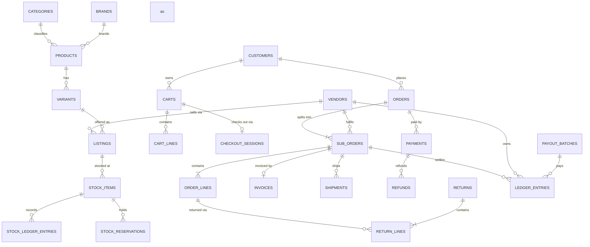

# 03 — Database Design (PostgreSQL 18)

> One database, one **schema per module**, no cross-schema foreign keys.
> Cross-module references are stored as plain UUID columns and validated by the owning module.

---

## 1. Global Conventions

| Convention | Rule |
|---|---|
| Naming | `snake_case`; tables **plural**; columns singular; PK `id`; FK `<entity>_id` |
| Primary keys | `uuid` holding **UUIDv7** generated in application code (time-ordered → index-friendly, no PK contention, safe to expose) |
| Tenancy | Every business table carries `tenant_id uuid not null`; every index is `(tenant_id, ...)`-prefixed; EF global query filter enforces it |
| Timestamps | `created_at timestamptz not null default now()`, `updated_at timestamptz`, both UTC |
| Auditing | `created_by uuid`, `updated_by uuid` on mutable business tables; full before/after in `platform.audit_logs` |
| Soft delete | `deleted_at timestamptz null` only where history matters (products, listings, categories, users, CMS). Elsewhere hard delete |
| Concurrency | System column `xmin` mapped as the EF concurrency token |
| Money | `numeric(18,4)`; a sibling `currency_code char(3) not null default 'INR'`. **Never** float |
| Quantity | `integer` for units; `numeric(12,3)` where a category needs fractional units |
| Percentages | `numeric(7,4)` (e.g. GST 18 → `18.0000`) |
| Enums | Postgres `text` + `CHECK` constraint, mapped to C# enums. Avoids native-enum migration pain |
| JSON | `jsonb` for genuinely open shapes (CMS blocks, gateway payloads, attribute snapshots) — never for relational data |
| Text search | `tsvector` generated columns + GIN; `pg_trgm` for fuzzy |
| Constraints | Every business invariant that *can* be a DB constraint *is* one |
| Time zone | Server UTC; display timezone from store settings |

### Extensions required

`pgcrypto`, `pg_trgm`, `unaccent`, `btree_gin`, `pg_stat_statements`.

---

## 2. Schema Map

| Schema | Module | Notes |
|---|---|---|
| `platform` | Platform | Tenants, settings, feature flags, audit, reference data, outbox |
| `identity` | Identity | Users, roles, sessions, addresses |
| `vendors` | Vendors | Sellers, KYC, commission plans, pickup locations |
| `media` | Media | Stored-file registry: keys, checksums, dimensions, scan state, visibility |
| `catalog` | Catalog | Taxonomy, products, variants, listings, media links |
| `inventory` | Inventory | Warehouses, stock, ledger, reservations, POs |
| `pricing` | Pricing | Price lists, tax rules, promotions, coupons, wallet |
| `carts` | Cart | Carts, lines, checkout sessions |
| `orders` | Orders | Orders, sub-orders, lines, events, invoices |
| `payments` | Payments | Payments, attempts, refunds, gateway events |
| `shipping` | Shipping | Zones, rates, serviceability, shipments, tracking |
| `returns` | Returns | RMAs, pickups, QC, credit notes |
| `settlements` | Settlements | Commission, ledger, payout batches |
| `search` | Search | Projections, synonyms, query log |
| `content` | Content | Pages, blocks, banners, menus, collections, redirects |
| `reviews` | Reviews | Reviews, Q&A, wishlist, subscriptions |
| `notifications` | Notifications | Templates, messages, preferences, delivery log |
| `reporting` | Reporting | Materialised views and rollup tables |

---

## 3. Core ERD (abridged to the commerce spine)

---

## 4. Table Specifications

Only columns that carry design decisions are listed; every table also has the standard
`tenant_id`, audit and timestamp columns from §1.

### 4.1 `platform`

**`tenants`** — `id`, `code` (unique), `name`, `status`, `settings jsonb`
**`store_settings`** — `tenant_id`, `key`, `value jsonb`, `is_public bool`, unique `(tenant_id, key)`
Holds legal entity, GSTIN, addresses, support contacts, business rules (return window, COD cap),
locale, timezone, and **all branding references**. Nothing branded is compiled in.

**`feature_flags`** — `key`, `enabled`, `rollout jsonb`, `description`
**`audit_logs`** — `actor_id`, `actor_type`, `action`, `entity_type`, `entity_id`, `before jsonb`, `after jsonb`, `ip`, `user_agent`, `correlation_id`, `occurred_at`. Append-only; monthly partitions.
**`outbox_messages`** — `id`, `type`, `payload jsonb`, `occurred_at`, `processed_at`, `attempts`, `error`, `correlation_id`. Index `(processed_at, occurred_at) where processed_at is null`.
**`inbox_messages`** (idempotent handling) — `message_id`, `handler`, `processed_at`, PK `(message_id, handler)`.
**`idempotency_keys`** — `key`, `endpoint`, `request_hash`, `response_status`, `response_body jsonb`, `expires_at`, unique `(tenant_id, key, endpoint)`.
**`states`** — official Indian states/UTs with GST state code.
**`pincodes`** — `pincode`, `city`, `district`, `state_id`, `zone`.
**`hsn_codes`** — `code`, `description`, `default_gst_rate`.

### 4.2 `identity`

**`users`** — `mobile` (E.164, unique per tenant), `email` (unique per tenant, nullable),
`password_hash` (nullable — OTP-only and provider-only users exist), `mobile_verified_at`,
`email_verified_at`, `status`, `user_type` (`customer|vendor|staff`), `failed_attempts`,
`locked_until`, `totp_secret_encrypted`, `totp_enabled`, `must_change_password` (set when an
administrator issues a temporary password; the next sign-in is challenged, not sessioned).
**`external_logins`** — `user_id`, `provider` (`google|facebook`), `subject` (the provider's stable
id), `email`, `email_verified`, `display_name`, `linked_at`, `last_login_at`. Unique
`(tenant_id, provider, subject)`. The subject is the only linking key; see
`07-security-compliance.md` §1 for why an email address is not.
**`roles`** — `code`, `name`, `scope` (`platform|vendor`), `is_system`.
**`permissions`** — `code`, `group`, `description`.
**`role_permissions`**, **`user_roles`** — `user_id`, `role_id`, `vendor_id` (nullable; set for
vendor-scoped role assignments).
**`refresh_tokens`** — `token_hash`, `user_id`, `device`, `ip`, `expires_at`, `revoked_at`,
`replaced_by_id`. Rotation chain retained for detection of reuse.
**`otp_challenges`** — `destination`, `channel`, `code_hash`, `purpose`, `attempts`, `expires_at`, `consumed_at`.
**`customer_profiles`** — `user_id`, `first_name`, `last_name`, `dob`, `gender`, `gstin`,
`marketing_consent_at`, `referral_code`.
**`addresses`** — `user_id`, `label`, `recipient_name`, `mobile`, `line1`, `line2`, `landmark`,
`city`, `state_id`, `pincode`, `is_default_shipping`, `is_default_billing`, `gstin`, `type`.

### 4.3 `vendors`

**`vendors`** — `code`, `legal_name`, `display_name`, `slug`, `status`, `status_reason`, `gstin`,
`pan`, `business_type`, `registered_address jsonb`, `support_email`, `support_phone`, `about`,
`logo_file_id`, `banner_file_id`, `commission_plan_id`, `dispatch_sla_hours`,
`return_policy jsonb`, `serves_all_india`, `rating`, `onboarded_at`, `gateway_account_id`
(Razorpay Route linked account). `code` and `slug` are unique per tenant; the code is taken from
the `vendors.vendor_code_seq` sequence when the caller does not supply one.
**`vendor_users`** — `vendor_id`, `user_id`, `is_owner`, `job_title`. Unique per
(`vendor_id`, `user_id`); the membership only, since the account and its roles are Identity's.
**`vendor_kyc_documents`** — `vendor_id`, `document_type`, `file_id`, `number_masked`, `status`,
`verified_by`, `verified_at`, `rejection_reason`. One live document per (`vendor_id`,
`document_type`) — a replacement resubmits rather than accumulating. The full number is **never**
stored: verification compares the scan against what was typed, and nothing afterwards needs it.
**`vendor_bank_accounts`** — `vendor_id`, `account_name`, `account_number_encrypted`,
`account_number_last4`, `ifsc`, `bank_name`, `branch_name`, `is_primary`, `verification_status`.
At most one primary per vendor, enforced by a partial unique index. The number is AES-256-GCM
encrypted at the column under the `Encryption` key ring; the last four digits are kept in the clear
so a listing never has to decrypt.
**`commission_plans`** — `code`, `name`, `description`, `plan_type` (`flat|percentage|tiered`),
`default_rate`, `default_fixed_fee`, `is_active`, `is_default`. At most one default per tenant.
**`commission_plan_rules`** — `plan_id`, `category_id` (nullable = default), `min_price`,
`max_price`, `rate`, `fixed_fee`. Resolution: most specific category, then price band, then default.
Bands are half-open — `min_price` inclusive, `max_price` exclusive — so a ladder has no gap and no
overlap at a boundary.
**`vendor_pickup_locations`** — `vendor_id`, `label`, contact name and phone, address,
`state_id`, `pincode`, `is_default`, `is_active`, `courier_location_code`. Columns rather than
`jsonb`, unlike the registered address, because shipping queries them.
**`vendor_serviceable_regions`** — `vendor_id`, `scope` (`state|pincode_prefix`), `state_id`,
`pincode_prefix`, `is_excluded`. Where the seller is *willing* to deliver, which is a commercial
choice and not the courier's reach (that is `shipping`). A seller with `vendors.serves_all_india`
has no rows; otherwise the rows are an allow-list with exclusions, so "all of Karnataka except one
district" is two rows rather than a hundred.

### 4.4 `catalog`

**`categories`** — `parent_id`, `name`, `slug` (unique per tenant), `path ltree|text` materialised
path, `level`, `position`, `is_active`, `image_file_id`, `seo jsonb`, `attribute_set_id`.
**`brands`** — `name`, `slug`, `logo_file_id`, `is_active`.
**`attribute_sets`** — `code`, `name`, `description`.
**`attribute_set_members`** — `attribute_set_id`, `attribute_id`, `is_required`, `position`;
unique `(tenant_id, attribute_set_id, attribute_id)`. Requiredness lives on the membership, not
only on the attribute: wattage is optional in general and mandatory for a lamp.
**`attributes`** — `code`, `name`, `data_type`
(`text|number|boolean|select|multiselect|date`), `is_variant_defining`, `is_filterable`,
`is_searchable`, `is_required`, `unit`, `position`. A `CHECK` refuses `is_variant_defining` for any
type but `select` and `multiselect`: only a closed list can be an axis.
**`attribute_options`** — `attribute_id`, `value`, `label`, `swatch_hex`, `position`.
**`products`** — `category_id`, `brand_id`, `name`, `slug`, `description`, `short_description`,
`status`, `hsn_code`, `gst_rate`, `country_of_origin`, `manufacturer jsonb`, `importer jsonb`,
`packer jsonb`, `is_returnable`, `return_window_days`, `warranty`, `seo jsonb`,
`rating_avg numeric(3,2)`, `rating_count`, `published_at`, `search_vector tsvector generated`.
**`product_attribute_values`** — `product_id`, `attribute_id`, `value_text`, `value_number`,
`value_boolean`, `value_option_id`.
**`variants`** — `product_id`, `sku` (unique per tenant), `barcode`, `name_suffix`,
`weight_grams`, `length_mm`, `width_mm`, `height_mm`, `mrp`, `net_quantity`, `status`,
`position`, `is_default`.
**`variant_attribute_values`** — `variant_id`, `attribute_id`, `option_id`; the defining
combination. Always an option reference, never free text. The uniqueness rule lives on the parent:
`variants.attribute_hash` is a SHA-256 of the sorted `(attribute_id, option_id)` pairs, with a
unique index on `(tenant_id, product_id, attribute_hash)` — no index can span the child rows, so
the combination is folded into one deterministic value on the row that owns it.
**`listings`** — `vendor_id`, `variant_id`, `status`, `mrp`, `selling_price`,
`vendor_sku`, `handling_time_hours`, `is_cod_allowed`, `max_order_quantity`,
unique `(tenant_id, vendor_id, variant_id)`.
**`media_assets`** — one table for both galleries, discriminated by which owner column is set:
`product_id` **or** `variant_id` (a `CHECK` requires one), plus `file_id`, `kind`
(`image|video|document`), `alt_text`, `position`. Two tables would double every read the product
page makes, which needs the union in one query.
**`product_moderations`** — `product_id`, `vendor_id`, `submitted_by`, `submitted_at`, `status`
(`pending|approved|rejected|withdrawn`), `reviewer_id`, `notes`, `reviewed_at`. One **row per
submission**, not a column on the product: a product rejected twice and approved on the third
attempt is the normal case, and both refusals and their reasons are what an operator needs when the
seller asks why. A partial unique index allows one `pending` row per product.
**`catalog_jobs`** — bulk import and export: `kind` (`product_import|product_export`), `status`
(`queued|running|succeeded|partially_succeeded|failed`), `vendor_id`, `file_name`, `source_key`,
`result_key`, `total_rows`, `processed_rows`, `succeeded_rows`, `failed_rows`, `errors jsonb`
(the validation report, capped), `failure_reason`, `attempts`, `started_at`, `completed_at`. The
files themselves live in object storage under the two key columns, never in the row. Claimed by the
worker with `FOR UPDATE SKIP LOCKED`, like the outbox and the notification queue.

**Buy-box rule** — lowest landed price → then vendor rating → then dispatch SLA → then stock
availability. Configurable through the `buy-box` store-settings section, which carries the criteria
as an ordered list plus `treat_unrated_as_average`; the criteria are applied in that order, each
breaking the tie the previous left, and the last word is always the oldest offer so the winner is
reproducible.

### 4.5 `inventory`

**`warehouses`** — `vendor_id` (null = platform-owned), `code`, `name`, `address jsonb`,
`pincode`, `is_active`, `priority`, unique `(tenant_id, code)`. `priority` orders the locations an
allocator walks; the lowest number wins.

**`stock_items`** — `listing_id`, `warehouse_id`, `vendor_id`, `quantity_on_hand`,
`quantity_reserved`, `reorder_level`, `reorder_quantity`, `allow_backorder`, `allow_preorder`,
`preorder_available_at`, `tracking_mode` (`none|batch|serial`), `low_stock_notified_at`,
unique `(tenant_id, listing_id, warehouse_id)`.
Both quantity columns are **derived caches** maintained in the same transaction as the ledger,
with a nightly reconciliation job asserting they match the ledger sum. `tracking_mode` is the
batch/lot and serial flag: `none` everywhere unless a category needs otherwise, and enforcement is
per category rather than platform-wide. `low_stock_notified_at` is what stops one item below its
reorder level from alerting on every movement.

**`stock_ledger_entries`** — `stock_item_id`, `change` (signed, on hand), `balance_after`,
`reserved_change` (signed), `reserved_after`, `reason`
(`purchase|sale|reservation|release|return|adjustment|damage|transfer_in|transfer_out|correction`),
`reference_type`, `reference_id`, `note`, `actor_id`, `occurred_at`. **Append-only**, monthly
partitions on `occurred_at`. The two `*_change` columns exist because *both* quantity columns on
`stock_items` are caches: without a signed reserved delta, "reserved equals the ledger sum" is not
a statement the reconciliation job can make, and a lost reservation would be undetectable. A pure
reservation carries `change = 0`; a sale carries both, negative.

**`stock_reservations`** — `stock_item_id`, `reference_type` (`cart|order`), `reference_id`,
`line_reference_id`, `quantity`, `status` (`held|committed|released|expired`), `expires_at`,
`settled_at`. Unique `(tenant_id, stock_item_id, reference_type, reference_id, line_reference_id)`
while `status = 'held'`, so a retried checkout holds stock once rather than twice.

**`suppliers`** — `vendor_id` (null = platform-owned), `code`, `name`, `contact_name`, `email`,
`phone`, `gstin`, `address jsonb`, `payment_terms_days`, `is_active`, unique `(tenant_id, code)`.

**`purchase_orders`** — `number` (from a sequence), `supplier_id`, `warehouse_id`, `vendor_id`,
`status` (`draft|submitted|partially_received|received|cancelled`), `expected_at`, `subtotal`,
`tax_total`, `total`, `notes`.
**`purchase_order_lines`** — `purchase_order_id`, `listing_id`, `sku`, `description`,
`quantity_ordered`, `quantity_received`, `unit_cost`, `tax_rate`, `line_total`.

**`goods_receipts`** — `number`, `purchase_order_id`, `warehouse_id`, `status` (`draft|posted`),
`received_at`, `received_by`, `notes`.
**`goods_receipt_lines`** — `goods_receipt_id`, `purchase_order_line_id`, `stock_item_id`,
`quantity_accepted`, `quantity_rejected`, `rejection_reason`, `batch_code`, `expires_on`.
Posting a receipt is what writes the `purchase` ledger entries; a draft receipt moves nothing.

**`stock_takes`** — `number`, `warehouse_id`, `status` (`draft|counting|submitted|cancelled`),
`scheduled_for`, `submitted_at`, `submitted_by`, `notes`.
**`stock_take_lines`** — `stock_take_id`, `stock_item_id`, `expected_quantity`,
`counted_quantity`, `variance`, `note`. Submitting a stock take writes one `correction` ledger
entry per non-zero variance, which is the only sanctioned way an operator changes on-hand without
a movement behind it.

**`stock_batches`** — `stock_item_id`, `batch_code`, `quantity`, `manufactured_on`, `expires_on`,
`supplier_id`, unique `(tenant_id, stock_item_id, batch_code)`.
**`stock_serials`** — `stock_item_id`, `serial_number`, `batch_id`, `status`
(`in_stock|reserved|sold|returned|damaged`), `reference_id`, unique
`(tenant_id, stock_item_id, serial_number)`. Both tables exist for every deployment; only an item
whose `tracking_mode` says so is required to populate them.

Constraints: `quantity_on_hand >= 0`, `quantity_reserved >= 0`,
`quantity_reserved <= quantity_on_hand` (unless backorder allowed), `reorder_level >= 0`,
`quantity_received <= quantity_ordered`.

### 4.6 `pricing`

**`price_lists`** — `vendor_id` (null = platform-wide), `code`, `name`, `type`
(`base|sale|scheduled`), `priority`, `currency_code`, `starts_at`, `ends_at`, `is_active`,
unique `(tenant_id, code)`. `priority` orders the lists a resolver walks and the lowest number
wins, which is how a sale list beats a base list without the type being read as a rank.
A list with a `vendor_id` prices only that seller's offers; that is the whole of **per-vendor
pricing**, and it is why the column is here rather than on the item.

**`price_list_items`** — `price_list_id`, `listing_id`, `price`, `min_quantity`,
unique `(tenant_id, price_list_id, listing_id, min_quantity)`. **Tiered quantity pricing** is
several rows differing only in `min_quantity`; the resolver takes the highest tier at or below the
requested quantity. There is deliberately **no MRP column**: MRP is a statutory figure that belongs
to the product (§4.4), and a second copy of it here would be a second answer on an invoice.
An offer with no item in any applicable list is priced at `catalog.listings.selling_price`, so a
deployment that never creates a price list still has a price for everything.

**`tax_rates`** — `hsn_code`, `description`, `rate`, `cess_rate`, `effective_from`,
`effective_to` (null = open-ended), `is_active`, unique `(tenant_id, hsn_code, effective_from)`.
Resolution takes the row for the HSN whose window contains the supply date, latest `effective_from`
first; an HSN with no row falls back to the product's own `gst_rate` with zero cess, so a rate
change is a new row rather than an edit and history stays reconstructable.

**`promotions`** — `code` (null for automatic cart rules), `name`, `description`, `type`
(`percentage|fixed|free_shipping|bogo|bundle|tiered`), `applies_to` (`line|order|shipping`),
`value`, `scope jsonb` (categories, brands, vendors, listings, customer segments),
`conditions jsonb` (min quantity, first order only, payment method, the buy-X-get-Y and tier
tables), `stacking` (`exclusive|stackable`), `priority`, `starts_at`, `ends_at`,
`usage_limit_total`, `usage_limit_per_customer`, `usage_count`, `min_order_value`, `max_discount`,
`is_active`, unique `(tenant_id, code)` where `code` is not null.
`usage_count` is a **derived cache** of the redemption rows, incremented by a conditional `UPDATE`
so two shoppers racing for the last coupon produce one redemption and one refusal — the same
device, and for the same reason, as the reservation update in §4.5. `starts_at`/`ends_at` are what
a **flash sale** is: there is no separate table, because a flash sale is a promotion with a short
window and a low priority number.

**`promotion_redemptions`** — `promotion_id`, `code`, `customer_id`, `order_id`,
`discount_amount`, `redeemed_at`, `reversed_at`, unique `(tenant_id, promotion_id, order_id)`.
The uniqueness is what makes redemption idempotent under at-least-once event delivery: an
`OrderPlaced` seen twice redeems once. Per-customer limits are counted from these rows, so a
reversed redemption is retained rather than deleted.

**`wallets`** — `customer_id`, `balance`, `currency_code`, `is_active`,
unique `(tenant_id, customer_id)`.
**`wallet_transactions`** — `wallet_id`, `type` (`credit|debit|expiry|reversal`), `amount`
(always positive; `type` carries the sign), `balance_after`, `reason`, `reference_type`,
`reference_id`, `expires_at`, `note`. **Append-only**; `balance` on the wallet is a derived cache
maintained in the same transaction, and unique `(tenant_id, wallet_id, reference_type,
reference_id, type)` where `reference_id` is not null makes a credit for one refund happen once.
Both tables exist in every deployment and are gated at the API by the `pricing.store-credit`
feature flag, so store credit is designed now and switched on when the business wants it.

Constraints: `price >= 0`, `min_quantity >= 1`, `rate BETWEEN 0 AND 100`, `cess_rate >= 0`,
`effective_to IS NULL OR effective_to >= effective_from`, `value >= 0`, `usage_count >= 0`,
`ends_at IS NULL OR ends_at > starts_at`, `balance >= 0`, `amount > 0`.

**Quote engine output** (not persisted here; returned to callers and snapshotted by Orders):
per line — `unit_mrp`, `unit_price`, `quantity`, `gross`, `line_discount`,
`order_discount_allocated`, `taxable_value`, `cgst`, `sgst`, `igst`, `cess`, `line_total`;
per sub-order — shipping, shipping tax, COD fee; per order — grand total, rounding adjustment.
Prices are held and quoted **inclusive of GST** (§7 of `02-domain-model.md`), so every tax figure
above is back-calculated from the gross rather than added to it, and a discount reduces the
taxable value before the split. The engine is one implementation shared by cart, checkout, orders
and invoices; nothing else in the platform is permitted to compute a tax figure.

### 4.7 `carts`

**`carts`** — `customer_id` (nullable), `anonymous_token_hash`, `status`
(`Active|Converted|Abandoned|Expired`), `currency_code`, `coupon_code`, `line_count`,
`last_activity_at`, `expires_at`, `converted_at`, `converted_order_id`, `abandoned_at`,
`reminder_count`, `last_reminder_at`, unique `(tenant_id, customer_id)` where `customer_id` is not
null **and `status = 'Active'`**, unique `(tenant_id, anonymous_token_hash)` where the hash is not
null.
One live cart per shopper is the whole of "persistent cart": the partial index is what makes a
second device continue the first one rather than open a rival. A cart is either a shopper's or a
browser's — `customer_id` and `anonymous_token_hash` are never both null, and merge-on-login is
what turns the second into the first.
The **token is stored hashed**, not in the clear. It is a bearer capability that identifies a
basket to anyone holding it, so it is treated as `identity.user_sessions.refresh_token_hash` is
(§4.2): the value lives in the shopper's cookie, the row holds SHA-256 of it, and a dump of this
table hands an attacker nobody's cart.
`line_count` is a **derived cache** maintained in the same transaction as the lines, because the
header badge is read on every page of the storefront and counting a child table for it would be the
most frequent query on the site.

**`cart_lines`** — `cart_id`, `listing_id`, `vendor_id`, `quantity`, `saved_for_later bool`,
`unit_price_at_add`, `priced_at`, `added_at`, unique `(tenant_id, cart_id, listing_id)`.
`vendor_id` is denormalised from the offer at the moment it is added. Cart grouping, per-seller
shipping and the sub-order split all key on it, and re-asking Catalog for it on every render would
be a contract call per line on the hottest path in the basket.
`unit_price_at_add` is **not** a price the shopper is owed — the quote engine (§4.6) is the only
thing that prices anything. It exists so the cart can say *"the price of this changed since you
added it"*, which is a required disclosure before payment and is unanswerable without a figure to
compare against.

**`checkout_sessions`** — `cart_id`, `customer_id`, `status`
(`Draft|AddressSet|ShippingSet|PaymentSet|Placing|Placed|Abandoned|Expired`),
`shipping_address_snapshot jsonb`, `billing_address_snapshot jsonb`, `place_of_supply_state_id`,
`gstin`, `payment_method` (`Prepaid|CashOnDelivery`), `quote_snapshot jsonb`, `shipping_total`,
`grand_total`, `expires_at`, `placed_at`, `order_id`, `order_number`,
unique `(tenant_id, cart_id)` where `status` is one of the open states.
The addresses are **snapshots, not references**. An order is a record of what was agreed, and an
address the shopper edits between checkout and delivery must not silently rewrite where the parcel
was promised. `place_of_supply_state_id` is lifted out of the shipping snapshot into its own column
because it decides CGST+SGST versus IGST and is therefore queried, not merely displayed.
`quote_snapshot` is the `QuoteResult` of §4.6 verbatim, re-taken at review and again at placement;
Orders copies it onto the order rather than re-pricing, which is what makes the total on the
confirmation the same number the shopper agreed to.

**`checkout_shipments`** — `checkout_session_id`, `vendor_id`, `option_code`, `carrier`,
`service_name`, `amount`, `tax_amount`, `dispatch_sla_hours`, `promised_min_days`,
`promised_max_days`, unique `(tenant_id, checkout_session_id, vendor_id)`.
One row per seller in the basket, which is what "per-vendor shipping and dispatch SLA" means in a
marketplace: two sellers ship separately, are quoted separately and promise separately. A single
`shipping_option_id` on the session cannot express that, and a basket that pretended otherwise
would quote one delivery date for two parcels.

**`checkout_placements`** — `checkout_session_id`, `idempotency_key`, `request_hash`, `status`
(`InProgress|Succeeded|Failed`), `order_id`, `order_number`, `response jsonb`, `failure_code`,
`completed_at`, unique `(tenant_id, idempotency_key)`.
This is what makes **place-order idempotent**, and it is a table rather than a cache because the
guarantee has to survive a restart: a shopper who double-taps *Pay* on a flaky connection must get
one order and two identical responses. The unique index is the enforcement — the second request
loses the insert and reads the winner's row — and `request_hash` catches the other failure, a key
replayed against a different basket, which is answered with a conflict rather than with somebody
else's order.

Constraints: `quantity >= 1`, `line_count >= 0`, `unit_price_at_add >= 0`, `amount >= 0`,
`tax_amount >= 0`, `reminder_count >= 0`, `expires_at > created_at`,
`customer_id IS NOT NULL OR anonymous_token_hash IS NOT NULL`.

**Retention.** A cart is not kept for ever. `expires_at` is set from a configured lifetime and
refreshed on every write; a sweeper marks a stale `Active` cart `Abandoned` — which is the whole of
**abandoned-cart capture**, and why the row is retained rather than deleted — and an `Abandoned`
cart older than the retention window `Expired`. Nothing here holds stock: a reservation is
Inventory's (§4.5), it is taken at placement and never at add-to-cart, and it is what §4.5's
sweeper releases when a checkout is abandoned.

### 4.8 `orders`

**`orders`** — `order_number` (human-readable, unique per tenant), `customer_id`, `cart_id`,
`checkout_session_id`, `customer_snapshot jsonb`, `shipping_address jsonb`, `billing_address jsonb`,
`place_of_supply_state_id`, `status`, `payment_method`, `payment_status`,
`items_total`, `discount_total`, `shipping_total`, `tax_total`, `cod_fee`, `wallet_applied`,
`rounding_adjustment`, `grand_total`, `amount_payable`,
`currency_code`, `coupon_code`, `channel`, `placed_at`, `completed_at`, `cancelled_at`,
`cancellation_reason`, `notes`.

`cart_id` is not decoration: it is the **stock-reservation reference**. Units are held against the
cart before the order exists (§4.5), and Orders settles those holds — commit on confirmation,
release on a pre-confirmation cancellation — through `IStockAvailability`.

`status` is **derived** from the sub-orders on every write and never set by a caller
(`02-domain-model.md` §5.2). It is stored so an order list can be filtered on it, and recomputed so
the stored value cannot disagree with the parts.

Monetary totals are **frozen at placement**. A cancellation does not rewrite them; it writes
`quantity_cancelled` on the lines, and what is still owed is derived from those. An order whose
totals changed after the fact could not be reconciled against the confirmation the shopper was sent.

**`sub_orders`** — `order_id`, `vendor_id`, `sub_order_number`, `status`, totals (same shape, plus
`shipping_tax` and `taxable_value`), the seller frozen for the invoice (`vendor_code`,
`vendor_name`, `vendor_gstin`), the delivery promise as the checkout quoted it
(`shipping_option_code`, `carrier`, `promised_min_days`, `promised_max_days`,
`dispatch_sla_hours`), `dispatch_due_at`, `confirmed_at`, `shipped_at`, `delivered_at`,
`return_window_ends_at`, `cancelled_at`, `cancelled_by`, `cancellation_reason`.

`dispatch_sla_hours` is copied from the seller at placement rather than read at confirmation, so a
seller who widens their SLA next week does not retroactively give themselves longer on an order the
shopper was already promised.

**`order_lines`** — `sub_order_id`, `vendor_id`, `listing_id`, `variant_id`, `product_snapshot jsonb`
(name, image, HSN, brand, category, weight and the return policy at time of purchase), `sku`,
`quantity`, `unit_mrp`,
`unit_price`, `discount_amount`, `taxable_value`, `gst_rate`, `cgst`, `sgst`, `igst`, `cess`,
`line_total`, `commission_rate`, `commission_amount`, `commission_plan_id`, `status`,
`quantity_cancelled`, `quantity_returned`.

`vendor_id` is denormalised down from the sub-order so the vendor query filter reaches the line;
`commission_plan_id` is stored because "which plan was applied" is the second question every seller
asks about a settlement.

**`order_events`** — `order_id`, `sub_order_id`, `type`, `from_status`, `to_status`,
`actor_type`, `actor_id`, `message`, `payload jsonb`, `is_customer_visible`, `occurred_at`.
Append-only. **Internal notes live here**, as `type = 'note'` with `is_customer_visible = false`:
they are things that happened to the order, in the order they happened, and a separate table would
mean an operator reading two lists and interleaving them by eye.

**`invoices`** — `order_id`, `sub_order_id` (unique — a sub-order is invoiced once), `vendor_id`,
`invoice_number` (unique per vendor per FY, gapless),
`series`, `financial_year`, `place_of_supply_state_code`, `is_intra_state`, `issued_at`,
`taxable_value`, `cgst`, `sgst`, `igst`, `cess`, `total`, `currency_code`,
`file_id`, `irn`, `qr_payload` (e-invoicing ready), `status`.

**`number_sequences`** — `kind` (`order|invoice`), `scope_key`, `financial_year`, `next_value`,
unique `(tenant_id, kind, scope_key, financial_year)`, locked with `SELECT ... FOR UPDATE` to
guarantee gapless allocation. One table with a discriminator rather than two tables of identical
shape: the allocation algorithm is one algorithm, and two tables would be two implementations of it.
An order number is scoped to a calendar period (`2609`) and an invoice number to a seller, which is
what keeps the lock per seller rather than platform-wide.

### 4.9 `payments`

**`payments`** — one collection against one order. `order_id`, `order_number`, `customer_id`,
`method` (`upi|card|netbanking|wallet|emi|cod|unknown`), `provider` (`razorpay|internal_cod`),
`provider_order_id`, `provider_payment_id`, `amount`, `amount_captured`, `amount_refunded`,
`currency_code`, `status`
(`Created|Authorized|Captured|Failed|Cancelled|PartiallyRefunded|Refunded`), `authorized_at`,
`captured_at`, `failed_at`, `expires_at`, `failure_code`, `failure_reason`, `idempotency_key`,
`receipt`, `notes jsonb`, `reconciled_at`, `settlement_id`.

`method` starts as `unknown` and is only ever written from what the gateway reports. A shopper
chooses *prepaid*; which rail they then paid on is the gateway's fact, and guessing it from the
checkout screen would put a wrong method on a reconciliation report.

Two uniqueness rules, and they carry the whole idempotency story. `(tenant_id, idempotency_key)` is
unique, so a replayed placement finds the collection it already opened rather than opening a second
one. And `(tenant_id, order_id)` is unique **partially** — `WHERE status IN ('Created',
'Authorized')` — so an order has at most one *open* collection while still being allowed the new one
a retry after failure needs. A single full unique index would make a retry impossible; none at all
would let a double-tap open two.

`amount` is copied from the order's `amount_payable` and never recomputed here. A gateway is asked
for a figure the shopper already agreed to, and a second calculation on this side of the seam is how
a payment and an invoice come to disagree.

**`payment_attempts`** — `payment_id`, `provider_payment_id` (unique per tenant where present),
`status`, `method`, `method_detail jsonb` (**masked**: card network and last four, bank name, UPI
handle, wallet name — never a PAN, never a CVV, never a full VPA), `amount`, `error jsonb`,
`source` (`checkout|webhook|reconciliation|admin`), `attempted_at`. Append-only.

One row per try, including the tries that failed, because "the customer says they paid three times"
is the commonest payment support call there is and a single mutable status column cannot answer it.
`source` records which of the four routes learned the fact, which is what makes a lost webhook
visible: an attempt whose source is `reconciliation` is one the webhook never delivered.

**`refunds`** — `payment_id`, `order_id`, `sub_order_id` (nullable), `return_id` (nullable),
`amount`, `currency_code`, `reason`, `status`
(`Requested|Approved|Rejected|Processing|Processed|Failed`), `provider_refund_id`,
`speed` (`normal|optimum|instant`), `initiated_by`, `initiated_at`, `approved_by`, `approved_at`,
`rejected_reason`, `completed_at`, `failure_reason`, `idempotency_key` (unique per tenant).

`approved_by` is a column rather than a workflow because the control it implements is statutory
housekeeping, not a preference: a refund above the configured threshold requires a second person
(`07-security-compliance.md` §4), and a refund whose `initiated_by` and `approved_by` are the same
user is refused by a check constraint rather than by a handler that could be forgotten. Refunds at
or below the threshold are approved on creation and carry the initiator in both columns' place —
`requires_approval` is stored so a later change to the threshold cannot retroactively make a
completed refund look unapproved.

Σ `refunds.amount` in a terminal-success state equals `payments.amount_refunded`, which is a cache
the reconciliation job asserts and deliberately does not repair.

**`gateway_events`** — `provider`, `event_id` (unique per tenant), `event_type`, `signature_valid`,
`payload jsonb`, `received_at`, `occurred_at`, `status`
(`Pending|Processed|Ignored|Failed|DeadLettered`), `processed_at`, `process_error`, `attempts`,
`next_attempt_at`, `payment_id` (resolved during processing).

The **payload is written once and never rewritten**; the processing columns beside it move. That
split is what makes the table both the replay-protection index and the dead-letter queue: the unique
`event_id` makes a redelivered webhook a no-op, and an event that has exhausted its attempts becomes
`DeadLettered` and waits for a human rather than being dropped. Nothing is ever deleted from it —
an unprocessable event is evidence.

**`cod_collections`** — `order_id`, `sub_order_id`, `shipment_id` (nullable until a shipment
exists), `amount`, `status` (`Pending|Collected|Remitted|Waived|WrittenOff`), `collected_at`,
`collected_by`, `remitted_at`, `remitted_amount`, `remittance_reference`. Unique per sub-order:
cash is collected once, at one door.

**`gateway_settlements`** — an imported settlement report. `provider`,
`provider_settlement_id` (unique per tenant), `amount`, `fees`, `tax`, `utr`, `status`, `settled_at`,
`imported_at`, `entry_count`, `matched_count`, `mismatch_count`, `raw jsonb`.

**`gateway_settlement_entries`** — one line of one report. `settlement_id`, `entry_type`
(`payment|refund|adjustment|transfer`), `provider_entry_id`, `provider_payment_id`, `payment_id`
(nullable — resolved by matching), `amount`, `fee`, `tax`, `debit`, `credit`, `match_status`
(`Matched|Unmatched|Mismatched`), `mismatch_reason`, `occurred_at`.

A second table rather than a `jsonb` array on the report, because the entries are what is actually
queried: "which of our captures has the gateway not settled" and "which settled amount does not
equal what we recorded" are both per-entry questions, and a mismatch has to be addressable by a
human who is going to act on one line of it.

### 4.10 `shipping`

**`shipping_zones`** — `name`, `states jsonb`, `pincode_ranges jsonb`, `priority`.
**`shipping_rates`** — `zone_id`, `vendor_id` (nullable override), `method`
(`standard|express`), `min_weight`, `max_weight`, `min_order_value`, `max_order_value`,
`base_rate`, `per_kg_rate`, `free_above`, `cod_fee`, `eta_min_days`, `eta_max_days`.
**`serviceability_cache`** — `pincode`, `courier`, `prepaid_ok`, `cod_ok`, `eta_days`, `refreshed_at`.
**`shipments`** — `sub_order_id`, `courier`, `awb`, `status`, `label_file_id`,
`manifest_id`, `weight_grams`, `dimensions jsonb`, `pickup_scheduled_at`, `picked_up_at`,
`delivered_at`, `expected_delivery_at`, `provider_shipment_id`, `cod_amount`.
**`shipment_lines`** — `shipment_id`, `order_line_id`, `quantity` (supports partial shipment).
**`tracking_events`** — `shipment_id`, `status`, `location`, `remark`, `occurred_at`,
`raw jsonb`, unique `(shipment_id, provider_event_id)`.
**`ndr_records`** — `shipment_id`, `reason`, `attempt_number`, `action_taken`, `resolved_at`.

### 4.11 `returns`

**`returns`** — `return_number`, `sub_order_id`, `customer_id`, `type` (`return|replacement`),
`status`, `reason_code`, `reason_note`, `evidence_file_ids jsonb`, `requested_at`,
`approved_at`, `rejected_reason`, `pickup_awb`, `received_at`, `qc_status`, `qc_notes`,
`qc_by`, `refund_amount`, `refund_mode` (`original|wallet`), `closed_at`.
**`return_lines`** — `return_id`, `order_line_id`, `quantity`, `unit_refund`, `tax_refund`,
`restock_decision` (`restock|scrap|quarantine`).
**`return_reasons`** — configurable reason codes with per-reason policy (who pays return
shipping, whether evidence is required).
**`credit_notes`** — `return_id`, `credit_note_number` (gapless per vendor per FY), `issued_at`,
`taxable_value`, tax split, `total`, `file_id`.

### 4.12 `settlements`

**`ledger_entries`** — `vendor_id`, `entry_type` (`sale|commission|payment_fee|shipping_fee|
refund|refund_commission_reversal|tcs|tds|adjustment|payout`), `direction` (`credit|debit`),
`amount`, `reference_type`, `reference_id`, `sub_order_id`, `order_line_id`, `settlement_cycle_id`,
`payout_batch_id`, `occurred_at`, `note`. **Append-only.**
**`settlement_cycles`** — `vendor_id`, `period_start`, `period_end`, `status`, `gross_sales`,
`total_commission`, `total_fees`, `total_refunds`, `tcs`, `tds`, `net_payable`, `closed_at`.
**`payout_batches`** — `reference`, `status`, `total_amount`, `vendor_count`, `approved_by`,
`processed_at`, `provider_batch_id`.
**`payout_items`** — `payout_batch_id`, `vendor_id`, `settlement_cycle_id`, `amount`, `status`,
`provider_payout_id`, `utr`, `failure_reason`.

Balance check (asserted in tests and a nightly job):
`Σ credits − Σ debits = closing balance` per vendor, and `Σ payouts ≤ Σ settled net`.

### 4.13 `search`

**`product_search_projection`** — one row per (variant, buy-box listing): denormalised name,
brand, category path, attributes `jsonb`, price, discount %, rating, vendor, availability,
popularity score, `search_vector tsvector`, `updated_at`. GIN on `search_vector`, GIN on
attributes `jsonb`, btree on `(tenant_id, category_path, price)`.
**`search_synonyms`**, **`search_queries`** (query, result count, clicked position, session).

### 4.14 `content`

**`pages`** — `slug`, `type` (`home|landing|static|legal|blog`), `title`, `status`,
`published_at`, `scheduled_at`, `seo jsonb`, `version`.
**`page_versions`** — full `blocks jsonb` snapshot per version, with `created_by` — supports
preview and rollback.
**`page_blocks`** — `page_id`, `block_type`, `position`, `config jsonb`, `is_visible`,
`starts_at`, `ends_at`.
**`menus`** / **`menu_items`** — hierarchical navigation with link targets.
**`banners`** — `placement`, `media_file_id` (desktop + mobile variants), `link`, `priority`,
`starts_at`, `ends_at`, `is_active`.
**`collections`** — `name`, `slug`, `type` (`manual|rule`), `rules jsonb`, `seo jsonb`.
**`collection_items`** — `collection_id`, `product_id`, `position`, `is_pinned`.
**`redirects`** — `from_path`, `to_path`, `status_code`, `hit_count`.

### 4.15 `reviews`

**`reviews`** — `product_id`, `variant_id`, `customer_id`, `order_line_id` (proves purchase),
`rating`, `title`, `body`, `media jsonb`, `status` (`pending|approved|rejected`),
`moderated_by`, `vendor_reply`, `helpful_count`, unique `(order_line_id)`.
**`questions`** / **`answers`**, **`wishlists`** / **`wishlist_items`**,
**`stock_subscriptions`** (back-in-stock, price-drop).

### 4.16 `notifications`

**`notification_templates`** — `event_key`, `channel` (`email|sms|whatsapp|push|inapp`),
`locale`, `subject`, `body`, `provider_template_id` (**DLT template id for Indian SMS**),
`is_active`, `version`, `category` (the preference bucket it is opted out of), `is_sensitive`
(a one-time code: its rendered body is never persisted — ADR-017), `is_transactional`
(a transactional message ignores preferences; a marketing one does not).
Unique `(tenant_id, event_key, channel, locale)`.
**`notification_messages`** — `template_id`, `event_key`, `recipient`, `channel`, `payload jsonb`
(variables, redacted for a sensitive template), `subject`, `body`, `status`
(`queued|sending|sent|delivered|failed|bounced|suppressed`), `suppression_reason`
(`NoProvider|ChannelDisabled|OptedOut|NoRecipient|null`), `provider_message_id`, `attempts`,
`next_attempt_at`, `error`, `sent_at`, `delivered_at`, `user_id`, `correlation_id`.
Partitioned monthly by `created_at` (§8). Polled with
`FOR UPDATE SKIP LOCKED` on `(status, next_attempt_at)`, so more than one worker is safe by
construction; a partitioned table cannot return `xmin`, so it carries no optimistic-concurrency
token and does not need one.
**`notification_preferences`** — `user_id`, `category`, per-channel opt-in flags.
Unique `(tenant_id, user_id, category)`.

### 4.17 `media`

**`files`** — `storage_key` (the object key, unique per tenant per bucket), `visibility`
(`public|private`, which selects the bucket), `original_file_name`, `content_type`, `byte_size`,
`checksum_sha256`, `width`, `height`, `status` (`ready|quarantined|deleted`), `scan_state`
(`skipped|pending|clean|infected`), `scanned_at`, `owner_type` / `owner_id` (a soft reference back
to whatever the file belongs to, for the orphan sweep at Step 31), `uploaded_by`.
Unique `(tenant_id, visibility, storage_key)`; index `(tenant_id, created_at desc)`.

> No foreign key points at this table. Eight columns across six other schemas hold a `file_id`, and
> a cross-schema foreign key is forbidden (§1) — so those are **soft references**, resolved through
> `IMediaLibrary`, and a deleted file resolves to nothing rather than breaking a join (ADR-016).

### 4.18 `reporting`

Materialised views refreshed on schedule, plus rollup tables for anything needing history:
`mv_daily_sales`, `mv_vendor_performance`, `mv_category_sales`, `mv_inventory_ageing`,
`mv_return_analysis`, `mv_conversion_funnel`, `mv_settlement_summary`.
Reporting is **read-only** and may query only its own schema.

---

## 5. Indexing Strategy (the ones that matter)

| Table | Index | Why |
|---|---|---|
| `listings` | `(tenant_id, variant_id, status)` incl. `selling_price` | Buy-box resolution |
| `products` | GIN `search_vector`; `(tenant_id, category_id, status)` | Search & browse |
| `product_search_projection` | GIN `search_vector`, GIN `attributes`, `(tenant_id, category_path, price)` | Faceted PLP |
| `stock_items` | unique `(tenant_id, listing_id, warehouse_id)` | Lookup + integrity |
| `stock_ledger_entries` | `(stock_item_id, occurred_at desc)`; partitioned monthly | Ledger reads stay small |
| `orders` | `(tenant_id, customer_id, placed_at desc)`; `(tenant_id, status, placed_at desc)`; unique `order_number` | Account + ops lists |
| `sub_orders` | `(tenant_id, vendor_id, status, created_at desc)` | Vendor dashboard |
| `order_lines` | `(sub_order_id)`, `(listing_id)` | Detail + product sales |
| `gateway_events` | unique `(provider, event_id)` | Exactly-once webhooks |
| `ledger_entries` | `(vendor_id, occurred_at)`, `(settlement_cycle_id)`, `(payout_batch_id)` | Statements |
| `outbox_messages` | partial `(occurred_at) where processed_at is null` | Cheap polling |
| `tracking_events` | unique `(shipment_id, provider_event_id)` | Idempotent ingestion |
| `carts` | `(tenant_id, customer_id) where status='active'` | One active cart |

Rule: **no index is added without a query plan justifying it**, and unused indexes are removed
at Step 29 based on `pg_stat_user_indexes`.

---

## 6. Data Integrity Rules Enforced in the Database

- `CHECK (quantity_on_hand >= 0)`, `CHECK (quantity_reserved >= 0)`
- `CHECK (amount_refunded <= amount_captured)` on `payments`
- `CHECK (selling_price <= mrp)` on `listings` (legal requirement in India)
- `CHECK (rating BETWEEN 1 AND 5)` on `reviews`
- Unique gapless sequences via dedicated sequence tables with row locks (not `SERIAL`, which
  leaves gaps on rollback — unacceptable for GST invoice numbering)
- Partial unique indexes for "one active X per Y" rules
- `EXCLUDE` constraints for non-overlapping price-list validity windows per listing

---

## 7. Migrations

- EF Core migrations, one migration set per module `DbContext`, all applied by the
  `migrator` container in a single transaction per module.
- Generated as **idempotent SQL** for production; the SQL is reviewed in the PR, not just the C#.
- **Expand → migrate → contract** for breaking changes: add nullable column → backfill → switch
  code → drop old column in a later release. Never a destructive migration in the same deploy
  as the code change.
- Every migration must be reversible or accompanied by a documented recovery step.
- Seed data (roles, permissions, states, HSN, tax rates, default templates, default settings)
  is idempotent and re-runnable.

---

## 8. Performance, Retention & Housekeeping

| Concern | Approach |
|---|---|
| Partitioning | `audit_logs`, `stock_ledger_entries`, `tracking_events`, `notification_messages`, `search_queries` — monthly range partitions with automated creation and detach-after-retention |
| Retention | Audit 7y (statutory), gateway events 2y, notification bodies 90d (metadata longer), search queries 1y, expired carts 90d |
| Connection pooling | Npgsql pooling in-app; PgBouncer added only if connection counts demand it |
| Read scaling | Reporting reads from materialised views; a Postgres read replica is the documented next step, not a v1 requirement |
| Vacuum | Autovacuum tuned for hot tables (`stock_items`, `outbox_messages`, `carts`) |
| Backups | Nightly `pg_dump` + continuous WAL archiving for PITR; encrypted; copied off-VPS; **restore drill required at Step 31** |
