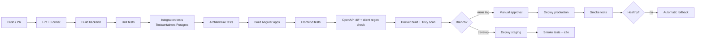

# 06 — Infrastructure, Containers & DevOps

> Everything runs in Docker containers on a VPS. Same images in every environment; behaviour
> differs only by environment variables and secrets.

---

## 1. Target Topology (single VPS)

```
                       Internet
                          │  443/80
                    ┌─────▼─────┐
                    │  Traefik  │  TLS (Let's Encrypt), routing, rate limit, headers
                    └──┬──┬──┬──┘
        ┌──────────────┘  │  └──────────────┐
        ▼                 ▼                 ▼
   storefront          admin              api  ──────► worker (no ingress)
   (Node SSR)        (nginx SPA)      (ASP.NET 10)          │
        │                 │                 │               │
        └─────────────────┴────────┬────────┴───────────────┘
                                   ▼
              ┌──────────┬─────────┴───────┬──────────┐
              ▼          ▼                 ▼          ▼
          postgres     redis             minio     imgproxy
              │                            │
              └── backups (encrypted, off-site) ──┘

   observability: prometheus · loki · promtail · grafana · (tempo optional)
```

Hostnames:

| Host | Container |
|---|---|
| `www.<domain>` / `<domain>` | storefront |
| `admin.<domain>` | admin |
| `api.<domain>` | api |
| `cdn.<domain>` | imgproxy (+ MinIO public bucket) |
| `grafana.<domain>` | grafana (IP-restricted / SSO) |

Staging mirrors this on the same VPS under `staging.*` with a separate compose project,
separate database and separate volumes — or on a second smaller VPS if the client prefers hard
isolation (recommended once live).

---

## 2. VPS Sizing

| Environment | vCPU | RAM | Disk | Notes |
|---|---|---|---|---|
| Staging | 2 | 4 GB | 60 GB SSD | Sufficient for UAT |
| Production (launch) | 4 | 8 GB | 160 GB NVMe | Postgres 2 GB shared buffers, API 2 GB, rest headroom |
| Production (growth trigger) | 8 | 16 GB | 320 GB | Move when p95 latency or CPU > 60 % sustained |

Provider: any Indian-region VPS (Hetzner has no India region — prefer AWS Lightsail Mumbai,
DigitalOcean Bangalore, E2E Networks, or the client's existing provider). **Data residency in
India is strongly recommended** for DPDP comfort and latency.

Scale-out path when a single VPS is no longer enough (documented now, executed only if needed):
1. Move Postgres to a managed instance or a dedicated node.
2. Move object storage to S3/R2 (already S3-API compatible — a config change).
3. Run 2+ API replicas behind Traefik; the API is stateless (sessions in Redis, files in S3).
4. Docker Swarm across nodes before considering Kubernetes.

---

## 3. Container Images

| Image | Base | Notes |
|---|---|---|
| `klarahome/api` | `mcr.microsoft.com/dotnet/aspnet:10.0-noble-chiseled` | Multi-stage build, non-root user, no shell in the runtime layer, `ReadyToRun` |
| `klarahome/worker` | same image | Different entrypoint/env (`APP_ROLE=worker`) |
| `klarahome/migrator` | same image | One-shot, `APP_ROLE=migrator`, exits non-zero on failure |
| `klarahome/storefront` | `node:22-alpine` | SSR server, non-root, only production deps |
| `klarahome/admin` | `nginx:alpine` | Static build output + hardened nginx conf |

Build rules: pinned base image digests, `.dockerignore` kept tight, layer caching via lockfile
copy first, images labelled with commit SHA and semantic version, **no secrets in any layer**,
Trivy scan gate in CI, images published to a private registry (GHCR or the VPS-hosted registry).

---

## 4. Compose Files

`infra/compose/docker-compose.base.yml` — service definitions
`docker-compose.dev.yml` — dev overrides (bind mounts, Mailpit, exposed ports, hot reload)
`docker-compose.staging.yml` / `docker-compose.prod.yml` — resource limits, replicas, secrets,
restart policies, logging driver.

Standards applied to every service:
- `restart: unless-stopped`
- `healthcheck` with sensible `start_period` (the API waits on Postgres readiness)
- `deploy.resources.limits` for CPU and memory — one container must never starve the host
- `logging: json-file` with `max-size: 10m`, `max-file: 3`
- named volumes only; **no bind mounts in production**
- an internal network for data services, with **no published ports** (only Traefik is exposed)
- `read_only: true` root filesystem with explicit `tmpfs` where writes are needed

### 4.1 Environment variables (representative)

```
ASPNETCORE_ENVIRONMENT
ConnectionStrings__Postgres
ConnectionStrings__Redis
Storage__Endpoint / AccessKey / SecretKey / Bucket / PublicBaseUrl
Jwt__Issuer / Audience / SigningKey / AccessTokenMinutes / RefreshTokenDays
Razorpay__KeyId / KeySecret / WebhookSecret / RouteEnabled
Shipping__Provider / ApiKey / WebhookSecret
Sms__Provider / ApiKey / SenderId / DltEntityId
Email__Provider / ApiKey / FromAddress
Tenant__Code / DefaultLocale / DefaultTimeZone
Observability__OtlpEndpoint
FeatureFlags__*
```

Secrets are **never** in compose files or the repo: Docker secrets (or SOPS-encrypted
`.env.enc` decrypted at deploy time), file-mounted, `*__File` convention supported by the app.

---

## 5. Traefik Configuration

- Automatic HTTPS via Let's Encrypt (HTTP-01 or DNS-01), HTTP→HTTPS redirect, HSTS.
- TLS 1.2+ only, modern cipher suite.
- Security headers middleware: `Strict-Transport-Security`, `X-Content-Type-Options`,
  `Referrer-Policy`, `Permissions-Policy`, `Content-Security-Policy` (CSP owned by the apps,
  asserted at the edge).
- Rate-limit middleware per router (stricter on `/api/v1/store/auth/*`).
- Gzip/Brotli compression; `Cache-Control` pass-through for static assets.
- Basic-auth or IP allow-list on Grafana and any internal dashboards.
- Access logs in JSON, shipped to Loki.

---

## 6. CI/CD



### 6.1 Deployment sequence (production)

1. Build and push images tagged with the commit SHA.
2. `docker compose pull` on the VPS over SSH (or a pull-based agent).
3. Run the **migrator** container to completion; abort the deploy on any non-zero exit.
4. Recreate `api` and `worker`, then `storefront` and `admin`, one at a time, waiting for health.
5. Run smoke tests against the live URLs (home, PDP, login, health, a read-only API call).
6. On failure: re-tag the previous images as current and recreate — rollback is a one-command
   script, tested at Step 32.

Database migrations follow **expand → migrate → contract**, so the previous image always
remains compatible with the new schema for the duration of a rollback window.

### 6.2 Branch & release strategy

- `main` = production, always deployable, protected, tagged releases (`v1.4.0`).
- `develop` = staging.
- `feature/*` → PR into `develop`; squash merge; Conventional Commits drive the changelog.
- `hotfix/*` → branched from `main`, merged to both.

---

## 7. Backups & Disaster Recovery

| Asset | Method | Frequency | Retention | Restore target |
|---|---|---|---|---|
| PostgreSQL | `pg_dump` (custom format) + continuous WAL archiving (PITR) | Dump nightly, WAL continuous | 30 daily, 12 weekly, 12 monthly | RPO ≤ 15 min, RTO ≤ 2 h |
| MinIO objects | `mc mirror` to off-site bucket | Nightly (hourly for new uploads) | 30 days + versioning | RTO ≤ 4 h |
| Configuration & secrets | Encrypted repo (SOPS) + offline copy | On change | Full history | Immediate |
| Container images | Registry retention | Per build | Last 20 + all release tags | Immediate |

All backups are **encrypted at rest, stored off the VPS**, and integrity-checked. A **restore
drill into a clean environment is a mandatory acceptance criterion of Step 31** — a backup that
has never been restored is not a backup.

---

## 8. Observability

| Signal | Stack |
|---|---|
| Logs | Serilog JSON → stdout → Promtail → **Loki** → Grafana |
| Metrics | OpenTelemetry / `prometheus-net` → **Prometheus** → Grafana |
| Traces | OpenTelemetry → **Tempo** (optional at launch, wired from day one) |
| Uptime | External synthetic checks (home, PDP, `/health/ready`, checkout smoke) |
| Alerts | Grafana Alerting → email + WhatsApp/Slack |

Dashboards at launch: API latency/error rate by endpoint, order funnel and volume, payment
success rate, webhook processing lag, outbox depth, job failures, Postgres health
(connections, slow queries, bloat, replication lag if applicable), container CPU/memory,
disk usage, certificate expiry.

Alert thresholds are defined at Step 31 and reviewed after two weeks of live traffic.

---

## 9. Security Hardening (infrastructure)

- SSH: key-only, root login disabled, non-standard port, fail2ban, optional IP allow-list.
- UFW/nftables: only 22, 80, 443 open; everything else on the internal Docker network.
- Unattended security upgrades; monthly patch window for the rest.
- Docker: non-root containers, `no-new-privileges`, dropped capabilities, read-only root FS,
  no `--privileged`, socket never mounted into an application container.
- Postgres: strong credentials, no public port, least-privilege application role (no superuser),
  separate migration role with DDL rights.
- Secrets rotated on a schedule and on any staff change; rotation runbook at Step 31.
- Weekly vulnerability scan of running images; monthly dependency update PRs.

---

## 10. Cost & Operating Notes

Recurring costs to budget: VPS (production + staging), domain, backup storage, transactional
email, SMS/WhatsApp (per-message, DLT registration required), Razorpay transaction fees,
logistics aggregator fees, optional CDN, optional managed Postgres later. All third-party
credentials are held by the client, not the vendor, and are listed in the handover pack at
Step 33.
